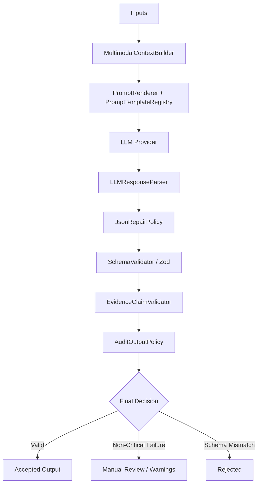

# 🛡️ Structured LLM Prompt Pipelines & Output Governance

Use when building system-level prompt pipelines where LLMs are tasked with producing structured schema-guided outputs (e.g. JSON matching Zod/JSON schemas) that must satisfy strict domain-level business/governance rules.

## 👑 Core Invariants & Governance Principles

1. **Separation of Confidence vs Classification**:
   * Do not conflate classification category (e.g., `observed`, `inferred`, `hypothesized`) with statistical confidence score (`0.0 - 1.0`).
   * A hypothesis or inference can have a mathematically high confidence (`0.99`) but *never* becomes a direct observed fact without verified direct evidence references.
2. **Safe JSON Repair Boundaries**:
   * **Allowed (Syntactic)**: Strip markdown fences (e.g., ` ```json `), isolate JSON object blocks from surrounding LLM conversational chatter, strip trailing commas immediately preceding closing braces (`}` or `]`), and unescape control characters.
   * **Strictly Forbidden (Semantic)**: Never allow a repair utility or mock provider to invent mock IDs (e.g., scene IDs, frame segments), inject fake timestamps, synthesize evidence refs, or change classifications. Such cases must be routed to `manual_review` or `rejected`.
3. **Artifact Hash Binding (Traceability)**:
   * Keep strict data lineage. Inputs passed into context must carry cryptographic hashes (e.g., SHA-256), and the resulting output structure must explicitly bind back to those exact hashes. Any mismatch rejects the payload.
4. **Hallucination Detection Gate**:
   * Cross-reference any references generated by the LLM (e.g. `scene_01`, `segment_02`) against the actual collection of input IDs. If the LLM generates a reference that was not in the input set, flag it immediately.
5. **Deep Composite Idempotency Fingerprinting**:
   * Reusing or returning an existing report artifact must never rely on a simple storage key alone. It must verify the full composite fingerprint:
     - `referenceAssetId`
     - SHA-256 hashes of all input artifacts
     - `promptVersion`
     - `modelVersion`
     - `reportSchemaVersion`
     - `adaptationPolicyVersion`
   * If any of these parameters diverge (e.g. prompt template adjusted, model bumped, or input file modified), cache is invalidated and fresh deterministic assembly is triggered.
6. **Semantic Business Invariants vs Exact String Matching**:
   * Validate outputs against domain business rules rather than fragile exact-string matching:
     - **Virality / Engagement Invariant**: Claims asserting high retention, CTR, or virality must never be marked `observed` without platform engagement analytics (must be `hypothesized` or `inferred`).
     - **Evidence Provenance**: Any `observed` claim must carry non-empty, valid `evidenceRefs`.
     - **Chronological Bounds**: All timestamp ranges must satisfy `0 <= startMs <= endMs <= durationMs`.
     - **Brand & Term Integrity**: Validate proper trademark capitalization and domain terminology preservation across OCR and transcript extraction.
7. **Four Pillars of Truth in Creative & Niche Adaptation**:
   * When adapting competitor/reference creative formats into brand-safe assets, isolate inputs into four decoupled layers:
     - **Reference Audit**: Extract abstract narrative/delivery mechanisms only (hook types, rhythm, narrative arc). Never dump raw competitor transcripts into the generation context.
     - **Brand Knowledge Base (Approved Facts SSOT)**: Strict versioned catalog of verified technical/material/commercial claims (`ApprovedBrandFact`). Unbacked claims must trigger `manual_review`.
     - **Adaptation Request**: User/target parameters (audience, tone, target duration, language).
     - **Governance & Policy**: Separate thresholds for lexical vs structural similarity, forbidden claims, and fail-closed human review rules.

## 📐 Canonical Architecture Patterns

A production-grade prompt pipeline consists of these decoupled building blocks:



### 1. Context Builder & Template Registry
* **Context Builder**: Serializes domain artifacts (transcript lines, frames, bounding boxes) into clean XML/Markdown schemas that the LLM's system-prompt expects. Captures partial inputs to inject default warnings immediately.
* **Template Registry**: Stores versioned prompt templates separately from code logic to allow multi-agent updates and regression audits.

### 2. Response Parser & Repair Policy
* **JsonRepairPolicy**: Implement robust, idempotent regex patterns to clean malformed JSON.
```typescript
class JsonRepairPolicy {
  static repair(raw: string): string {
    let repaired = raw.trim();
    // 1. Remove Markdown fences
    repaired = repaired.replace(/^```json\s*/i, "").replace(/```\s*$/, "").trim();
    // 2. Clear trailing commas before closing symbols
    repaired = repaired.replace(/,\s*}/g, '}').replace(/,\s*]/g, ']');
    return repaired;
  }
}
```

### 3. Claim & Evidence Validator
* Evaluates semantic coherence rules.
* Asserts that `observed` classifications have at least one non-empty evidence reference.
* Verifies chronological safety (e.g., `startMs <= endMs`).

### 4. Output Policy
* Coordinates downstream routing. Flags overflows (e.g., outputs exceeding 1MB).
* Assigns final execution status (`accepted`, `manual_review`, `rejected`).

## ⚠️ Common Pitfalls & Solutions

### 1. Trailing Comma Test Setup Failures
* **Pitfall**: When mock-testing the JSON repairer, a simple replacement like `replace('"confidence":0.9', '"confidence":0.9,')` on a serialized string creates a **double comma** (`,,`) if the property was not at the very end of the object. Double commas are syntactically invalid and cannot be resolved by standard trailing-comma regexes.
* **Solution**: Replace a property that directly precedes the closing curly brace `}`:
  ```typescript
  const rawWithTrailingComma = JSON.stringify(validObj).replace(
    '"lastProperty":"value"}',
    '"lastProperty":"value",}'
  );
  ```

### 2. Regex Constraints for Cryptographic Hashes
* **Pitfall**: Mocking SHA-256 strings in test suites using arbitrary characters (like `g`, `h`, `i`, etc.) will fail schema-validators that assert hexadecimal patterns (`/^[a-f0-9]{64}$/i`).
* **Solution**: Use valid lowercase hex characters only:
  ```typescript
  const mockSha256 = 'a1b2c3d4e5f6g7h8i9j0a1b2c3d4e5f6g7h8i9j0a1b2c3d4e5f6g7h8i9j01234';
  ```

### 3. Literal Types in Test Assertions
* **Pitfall**: Modifying a schema literal type (e.g., `schemaVersion: "multimodal-audit.v1"`) directly in TS to test a rejection scenario causes compilation errors since types are strictly defined.
* **Solution**: Cast the test object to `any` before mutating:
  ```typescript
  (validResult as any).schemaVersion = 'invalid-version';
  ```

### 4. Dual Dict vs Object Access in Downstream Consumers
* **Pitfall**: Replacing dataclasses or Pydantic models with pure `dict` breaks callers relying on attribute access (`result.answer`), while keeping pure objects breaks callers expecting dictionary indexing (`result["answer"]`) or JSON-serializable keys.
* **Solution**: Subclass `dict` (e.g. `class RAGAnswer(dict):`) initializing the expected dict keys via `super().__init__(data)` while simultaneously setting instance attributes (`self.key = val`). See `references/rag_synthesis_and_epistemic_contracts.md`.

## 📚 Linked References & Support Files
* [references/provider_adapters.md](references/provider_adapters.md) — Detailed architecture of lightweight, SDK-free provider adapters, neutral error mapping, token budgeting, secure logging, idempotent retry execution, and Vertex AI OpenAPI / thinking-models token invariants.
* [references/niche_adaptation_pipelines.md](references/niche_adaptation_pipelines.md) — Architecture of the Four Pillars of Truth, multi-dimensional similarity guards (lexical vs structural), teleprompter prosody/shotlist generation, and fail-closed human review governance.
* [references/rag_synthesis_and_epistemic_contracts.md](references/rag_synthesis_and_epistemic_contracts.md) — Grounded RAG answer synthesis (`_synthesize_answer`), epistemic status triage (`OBSERVED`, `INFERRED`, `HYPOTHESIS`), dual dict/attribute containers, and monorepo Pytest importlib collision isolation.
