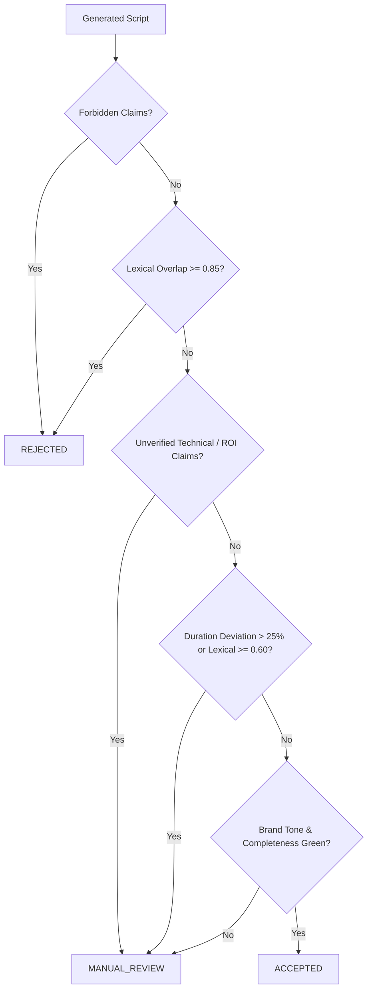

# 🧬 Safe Niche Adaptation & Brand Content Pipelines

Guidelines for designing deterministic and LLM-assisted pipelines that adapt reference creative content (e.g. viral videos, landing pages, ad copies) into brand-safe, domain-specific assets.

## 🏛️ The Four Pillars of Truth (Prompt & Context Isolation)

Never blend the raw reference content, brand facts, user request, and safety policies into a single monolithic prompt. Isolate them into four distinct layers:

1. **Reference Audit (Abstract Mechanisms Only)**:
   - Extract only structural delivery mechanisms: hook patterns (`contrarian_hook`, `problem_hook`, `curiosity_gap`), narrative beat pacing (`problem_solution`, `before_after`), scene durations, pause rhythms, and CTA structures.
   - Do NOT pass raw competitor transcripts directly into the creative generation context to prevent unintended token verbatim echoing.

2. **Brand Knowledge Base (Approved Facts SSOT)**:
   - Every domain, engineering, material, safety, or pricing statement must originate from a versioned, verified fact database (`ApprovedBrandFact`).
   - Every fact must carry:
     - `id`: unique canonical identifier (e.g., `fact-reburn-aisi-304`).
     - `category`: `product` | `material` | `process` | `safety` | `commercial`.
     - `status`: `approved` | `draft` | `deprecated`.
     - `source`: verified internal test, engineering spec, or certification.
   - Script writers must tag which `usedFactIds` back their generated statements.

3. **Adaptation Request**:
   - Explicit target requirements: niche, target audience, target duration, language, and tone.

4. **Governance & Similarity Policies**:
   - Strict thresholds for similarity, tone compliance, and forbidden claims (e.g. non-certified indoor usage, unsubstantiated ROI promises).

---

## 🛡️ Multi-Dimensional Similarity & Plagiarism Guard

Evaluating similarity requires breaking overlap into decoupled dimensions:

| Dimension | Method | Target Threshold | Routing Action |
| :--- | :--- | :--- | :--- |
| **Lexical** | Jaccard index + character/word n-gram overlap on transcripts | `< 0.35` (Safe) `0.35 - 0.60` (Moderate) `0.60 - 0.85` (High) `>= 0.85` (Critical) | High: `manual_review` Critical: `rejected` |
| **Structural** | Alignment of narrative beat sequences, scene count, and role transitions | `0.50 - 0.90` (Expected) | High structural similarity is desired when transferring successful storytelling pacing. |
| **Visual / Rhythm** | Pacing cadence (cuts per minute), shot rhythm distribution | `0.40 - 0.80` (Normal) | Pacing matching is encouraged for retention replication. |
| **Brand Elements** | Entity extraction / regex scanning for creator handles, trademarks, or competitor names | `0.00` (Zero tolerance) | Any competitor brand leakage routes to `rejected`. |

---

## 🎭 Downstream Execution Transformers (Teleprompter & ShotList)

A script text is incomplete without production-ready execution blueprints:

### 1. Prosody Transformer (`prosody.v1`)
Prepares teleprompter text for vocal delivery:
- **Speech Rate (WPM)**: Calculates actual words per minute (typically 120-150 WPM for technical Ukrainian/English explainer videos).
- **Vocal Emphasis**: Highlights domain technical terms with `punch`, transitional points with `soft`, questions with `high` pitch.
- **Micro-Pauses**: Adds explicit millisecond pauses (`pauseAfterMs: 300 - 800ms`) after key claims and hook punchlines.
- **Speaker Gestures**: Injects non-verbal cues (`finger_point`, `lean_forward`, `palms_up`, `head_nod`).

### 2. ShotList Generator (`shot-list.v1`)
Produces scene-by-scene instructions for human videographers or automated video renderers (Remotion):
- Shot type (`close_up`, `medium_shot`, `b_roll`, `screen_recording`).
- Camera angle and movement (`eye_level`, `slight_low_angle`, `pan_right`).
- Text overlays (`lower_third`, `center_hero`) with precise duration markers.
- Visual description and B-roll guidance.

---

## ⚖️ Fail-Closed Human Review Governance

The pipeline must evaluate outputs via a strict fail-closed decision matrix:

