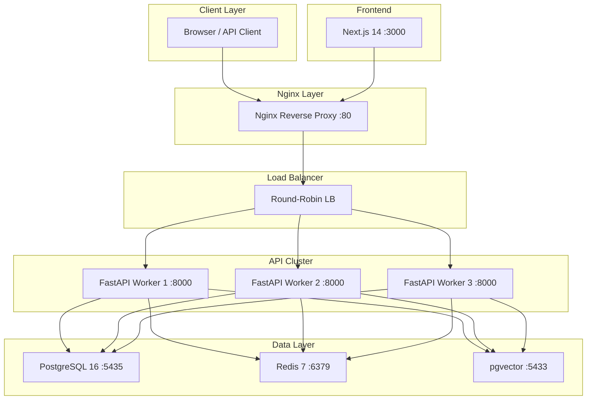
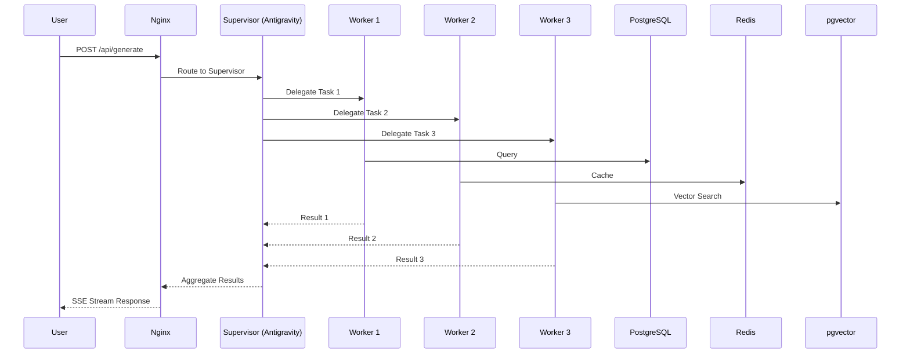
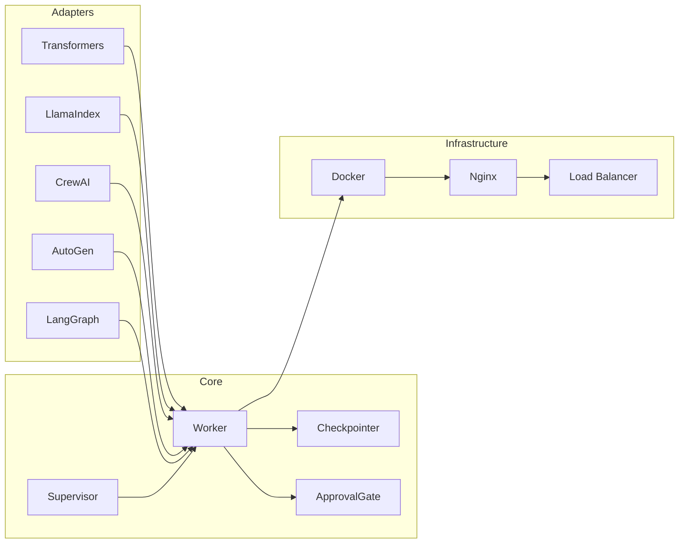
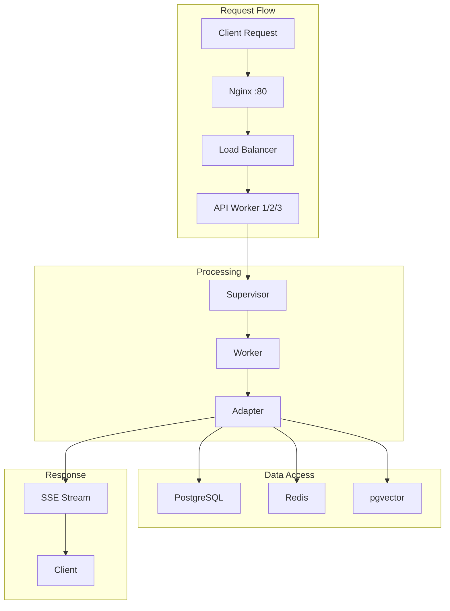
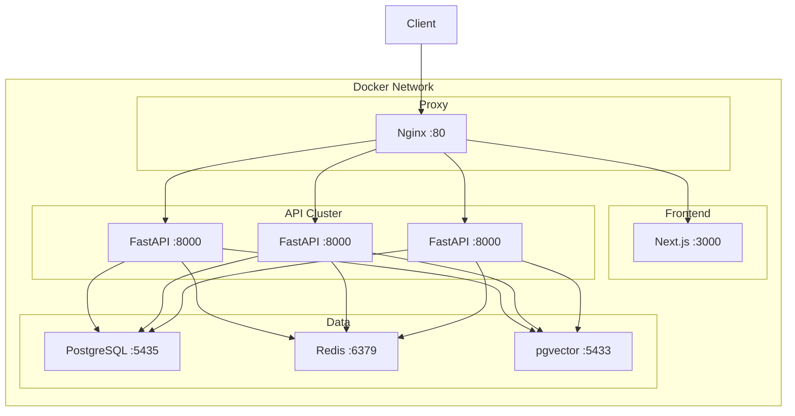

# --- DNK-MRH-HEADER ---
# mrh_id: "docs/architecture-specs.md"
# purpose: "Canonical Architecture Specifications, Topology and Multi-Agent Mermaid Diagrams for DNK OS."
# canonical_source: true
# alters_files: []
# triggers_tasks: []
# status: "Active"
# version: "3.0.0"
# updated_at: "2026-08-28"
# author: "DNK-e.com Maksym"
# --- END DNK-MRH-HEADER ---

# 🏛️ DNK OS MVP — Architecture Specifications & Mermaid Blueprints

This document contains the definitive architectural blueprint, data flow dynamics, component hierarchy, and deployment topology for **DNK OS MVP Multi-Agent Core**.

---

## 📑 Table of Contents
1. [System Architecture Diagram](#1-system-architecture-diagram)
2. [Multi-Agent Flow Sequence](#2-multi-agent-flow-diagram)
3. [Component Architecture Hierarchy](#3-component-architecture)
4. [Data Flow Pipeline](#4-data-flow-diagram)
5. [Deployment Topology & Container Mesh](#5-deployment-topology)
6. [Security & Isolation Matrix](#6-security--isolation-matrix)

---

## 1. System Architecture Diagram

The DNK OS MVP adopts a tiered multi-layer architecture separating Client Interface, Reverse Proxy / Load Balancing, Horizontally Scalable Workers, and Distributed Data Storage.

### Layer Details:
- **Client Layer**: Desktop browsers and HTTP/WebSocket clients communicating via REST and SSE.
- **Nginx Layer**: High-performance ingress proxy handling SSL, gzip compression, client rate limiting, and reverse proxying.
- **Load Balancer**: Round-robin distribution of API traffic across the worker pool.
- **API Cluster**: Horizontally scalable FastAPI worker instances (`dnk-api-1`, `dnk-api-2`, `dnk-api-3`).
- **Data Layer**:
  - `PostgreSQL 16`: Relational state, audit logs, Row-Level Security (RLS).
  - `Redis 7`: High-speed session checkpointing, distributed locks, Pub/Sub.
  - `pgvector`: 1536-dimensional embeddings for SCONES memory and RAG.
- **Frontend**: Next.js 14 App Router hosting React Flow Canvas and Stitch interface.

---

## 2. Multi-Agent Flow Diagram

Orchestration sequence showing user interaction, supervisor delegation, worker concurrency, and streaming response lifecycle.

### Execution Steps:
1. **User Dispatch**: The client submits a multi-step task generation prompt.
2. **Supervisor Delegation**: The `Antigravity` supervisor parses the TaskDNA and partitions work across workers.
3. **Parallel Worker Execution**:
   - `Worker 1` queries PostgreSQL for workspace entities and RLS state.
   - `Worker 2` interacts with Redis for cached session contexts and checkpointer keys.
   - `Worker 3` performs vector cosine-similarity lookups via `pgvector`.
4. **State Aggregation**: The supervisor compiles intermediate worker states into a unified DAG state.
5. **SSE Streaming**: Live tokens and status updates are piped through Nginx to the client browser in real time.

---

## 3. Component Architecture

Component hierarchy detailing the interface between framework adapters, orchestration core, checkpointers, and infrastructure.

### Component Roles:
- **Framework Adapters (`adapters/`)**: Pluggable abstraction layer normalizing execution interfaces across HuggingFace Transformers, LlamaIndex, CrewAI, AutoGen, and LangGraph.
- **Core Engine (`core/`)**:
  - `Supervisor`: State machine coordinator managing multi-agent DAGs.
  - `Worker`: Execution nodes executing atomic tasks and tools.
  - `Checkpointer`: State snapshotting engine supporting Memory, SQLite, and Redis/PostgreSQL backends.
  - `ApprovalGate`: Human-in-the-loop security gate for sensitive and mutating actions.
- **Infrastructure**: Container runtime, reverse proxy, and routing fabric.

---

## 4. Data Flow Diagram

End-to-end data processing lifecycle from initial client ingress down to persistence storage and outbound event streaming.

---

## 5. Deployment Topology

Container mesh topology mapping inter-container network links, ports, and isolation boundaries inside Docker Compose.

---

## 6. Security & Isolation Matrix

| Layer / Component | Security Control | Isolation Mechanism |
| :--- | :--- | :--- |
| **Ingress Proxy** | Nginx Rate Limiting (`rate_limit.conf`) | Max 100 req/sec per IP, burst=20 |
| **API Endpoints** | JWT Bearer & Workspace Header | `X-Workspace-ID` strict UUID RFC4122 validation |
| **Relational DB** | PostgreSQL RLS (Row-Level Security) | Tenant-isolated schemas (`ws-alpha-001`) |
| **Cache & State** | Key Namespacing & Token Expiry | `tenant:ws:session_id` strict key prefixing |
| **Approval Gate** | 2-Stage Verification Protocol | Human-in-the-loop blocking on destructive mutations |
