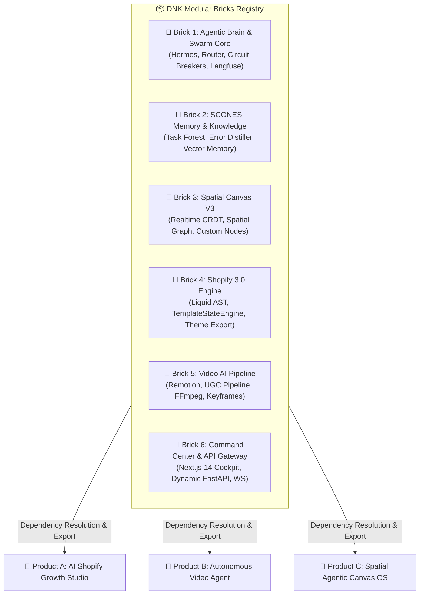
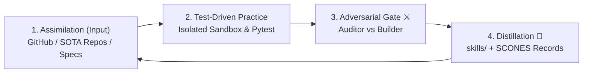

# --- DNK-MRH-HEADER ---
# mrh_id: "docs/architecture/DNK_BRICK_REGISTRY_SPEC.md"
# purpose: "Architecture Specification and Technical Blueprint for DNK Modular Brick Registry & Assembly Engine."
# canonical_source: true
# alters_files: []
# triggers_tasks: []
# status: "Active"
# version: "1.0.0"
# updated_at: "2026-09-02"
# author: "DNK-e.com Maksym & Gerych (Hermes Prime)"
# --- END DNK-MRH-HEADER ---

# 🧱 DNK Brick Registry & Agentic Assembly Engine Specification

## 🎯 Executive Summary
The DNK Brick Registry is the foundational architectural layer that transforms `DNK_HUB` from a monolithic repository into a high-velocity, modular **AI Product Foundry**. It standardizes 6 core functional domains into composable, isolated, and contract-driven "Bricks" capable of generating Tier-2 standalone client applications on demand.

---

## 🏗️ 1. The 6 Universal Core Bricks



### Brick Metadata Matrix

| Brick ID | Name | Core Components / Path | Contract Interfaces | Test Coverage Target |
| :--- | :--- | :--- | :--- | :--- |
| **BRICK-01** | `agentic_brain` | `core/hermes_agent`, `core/orchestrator` | TaskDNA, Subagent Dispatch, Tool Hooks | 100% Mocked Tool Loop |
| **BRICK-02** | `scones_memory` | `core/scones_memory.py`, `services/dnk_obsidian_task_forest` | Memory Store/Query, Error Distillation | 100% Persistence & Retrieval |
| **BRICK-03** | `spatial_canvas` | `services/dnk_canvas_api`, `apps/web/app/canvas` | Node AST, Spatial State, Realtime WS | 100% State Mutations |
| **BRICK-04** | `shopify_engine` | `services/dnk_shopify`, `services/dnk_shopify_builder` | Liquid AST, Section Schema, Theme Bundler | 100% AST Compilation |
| **BRICK-05** | `video_ai` | `services/dnk_video_ai_creator` | Timeline Schema, Remotion Bundle, Audio Sync | 100% Render Smoke |
| **BRICK-06** | `web_api_shell` | `apps/web`, `apps/api` | FastAPIRouter, Session Auth, Webhook Bridge | 100% Route E2E |

---

## 📜 2. Formal Brick Manifest Specification (`brick.manifest.yaml`)

Each Brick in `core/bricks/<brick_id>/` must adhere to the standard schema:

```yaml
# Example: core/bricks/brick_shopify_engine/brick.manifest.yaml
id: "brick_shopify_engine"
name: "Shopify 3.0 Engine"
version: "1.0.0"
mrh_id: "core/bricks/brick_shopify_engine/brick.manifest.yaml"
category: "ecommerce_ast"
description: "Liquid AST parsing, Section Schemas, TemplateStateEngine mutations, and Theme packaging."

dependencies:
  internal:
    - "brick_scones_memory"
  external:
    python:
      - "liquidpy>=0.8.0"
      - "pydantic>=2.7.0"
    npm:
      - "@shopify/theme-check"

contracts:
  python_schema: "./contracts/schemas.py"
  typescript_types: "./contracts/types.ts"

entrypoints:
  service: "services.dnk_shopify.main:app"
  cli: "services/dnk_shopify/cli.py"

quality_gate:
  test_suite: "tests/services/test_shopify_*.py"
  min_coverage: 90
```

---

## ⚙️ 3. Senior AI Engineer 4-Level Evolution Loop



1. **Assimilation (SOTA Intake)**: Ingest external best practices into structured `skills/` using the 2-track license model (MIT direct vs Copyleft clean-room).
2. **Test-Driven Practice**: No skill or brick is marked production-ready without deterministic, green unit and integration tests.
3. **Adversarial Gate (Builder 🛡️ vs Auditor ⚔️)**: Automated pre-commit audit checking relative paths, zero absolute path leaks, security boundaries, and strict typing.
4. **Distillation (Zero-Recurrence Memory)**: Failed runs trigger `dnk_query_error_solutions` and write distilled fixes directly into `scones_memory`.

---

## 🚀 4. App Assembly & Export Workflow

```bash
# Example Autonomous Assembly Command (CLI / Agent tool)
python3 scripts/export_standalone_app.py \
  --app-id "ai_shopify_growth_studio" \
  --bricks brick_shopify_engine brick_video_ai brick_web_api_shell \
  --target-dir "../dist/ai_shopify_growth_studio"
```

The Assembly Engine:
1. Resolves DAG dependencies between selected bricks.
2. Copies source modules with relative import normalization.
3. Packages unified `pyproject.toml` and `package.json`.
4. Runs `scripts/verify_all.sh` inside the generated target to ensure 100% standalone viability.
