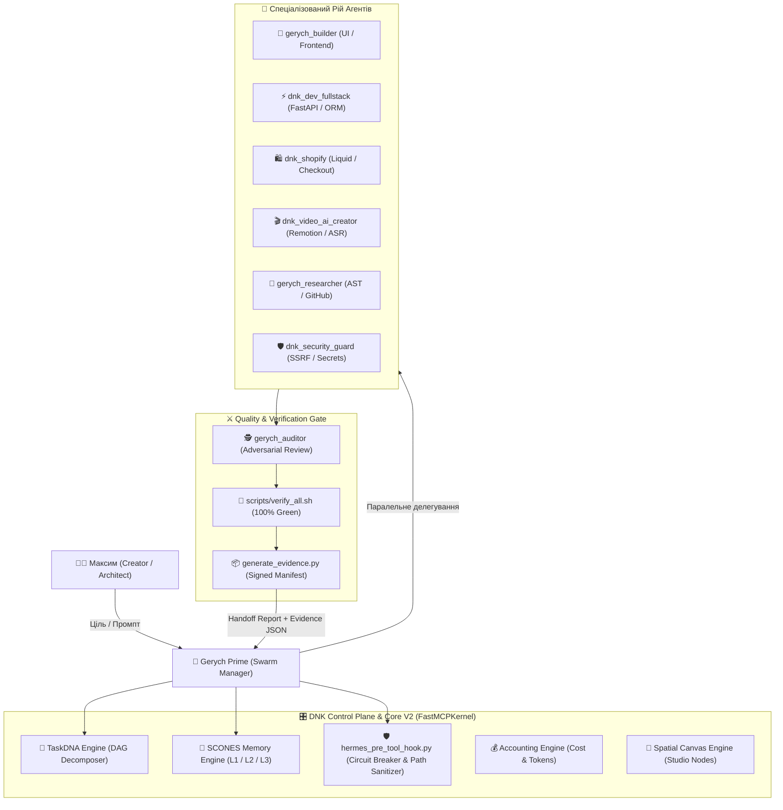

# --- DNK-MRH-HEADER ---
# mrh_id: "docs/architecture/DNK_ZERO_WASTE_SWARM_PROTOCOL_V4_3_0.md"
# purpose: "Canonical Architectural Specification & Deep Dive for Zero-Waste Swarm Protocol v4.3.0."
# canonical_source: true
# alters_files: []
# triggers_tasks: []
# status: "Active"
# version: "4.3.0"
# updated_at: "2026-09-04"
# author: "DNK-e.com Maksym & Gerych Prime"
# --- END DNK-MRH-HEADER ---

# 🐝 DNK OS Architecture: Zero-Waste Swarm Protocol v4.3.0
### Swarm Manager, Chief Builder, and Autonomous Engineering Fabric

---

## 1. Концепція та мета Zero-Waste Swarm Protocol v4.3.0

### 1.1. Головна мета
**Zero-Waste Swarm Protocol (ZWSP v4.3.0)** — це нормативна інженерно-операційна система DNK OS, спроєктована для забезпечення **10x швидкості виконання** автономних завдань при **абсолютній мінімізації нецільових витрат** обчислювальних ресурсів, контексту мовних моделей, робочого часу розробника (Максима) та енергії агентного рою.

Протокол перетворює наївну "чат-групу агентів" на детерміністичний **виробничий конвеєр** із чіткими контрактами передачі результатів, захистом від збоїв (circuit breakers) та автоматичними воротами якості (Quality Gates).

### 1.2. Що вважається «відходами» (Waste) у мультиагентній системі
У парадигмі ZWSP відходами класифікуються будь-які дії, операції або дані, які не наближають систему до верифікованого робочого артефакту:

1. **Token & Context Waste (Контекстне марнотратство):**
   - Завантаження у контекст повних файлів по 1000–3000 рядків заради зміни 5 рядків.
   - Нескінченне передавання історії чату між субагентами (Context Explosion).
   - Відсутність зрізів та фільтрації AST при читанні кодової бази.
2. **Loop & Guessing Waste (Марнотратство сліпих ітерацій):**
   - Сліпі спроби виправлення помилок ("спробуємо ще цей імпорт") без вивчення реального стек-трейсу або звернення до бази дистильованих помилок.
   - Повторні читання та перезаписи одного й того самого файлу по колу (Chrun Loops).
3. **Duplication & Drift Waste (Дублювання та розсинхронізація):**
   - Написання функціональності, яка вже існує в сусідніх модулях або бібліотеці SCONES.
   - Подвійні дерева коду, розрив між репозиторієм R&D та клієнтським дистрибутивом.
4. **Orphan & Zombie Waste (Завислі задачі та процеси):**
   - Завислі підпроцеси та блокування бази сесій SQLite (`.hermes/sessions.db`).
   - Задачі, взяті в роботу кількома агентами одночасно (Race Conditions).
5. **Fabrication & Narrative Waste (Галюцинації та псевдозвіти):**
   - Текстові твердження "я все виправив", не підтверджені кодом повернення тестів (`exit_code: 0`).

### 1.3. Механізми ліквідації відходів у v4.3.0
- **TaskDNA First:** Жодного написання коду без попередньої декомпозиції цілі у спрямований ациклічний граф (DAG) із чіткими контрактами інтерфейсів.
- **SCONES Memory Retrieval First:** Обов'язкове вилучення готових паттернів та архітектурних рішень перед генерацією бойлерплейту.
- **Instant Self-Healing Distillation:** При першому ж збої тесту — звернення до дистильованої бази знань (`dnk_query_error_solutions`), виправлення за перевіреним шаблоном і фіксація розв'язання (`dnk_record_error_solution`).
- **Context Diet & Circuit Breakers:** Обмеження зрізів читання до 80–120 рядків, ліміт повторних викликів читання/патчів одного файлу, перехоплення на рівні pre-tool hook.
- **Process Guard Singleton Locks:** Запобігання конфліктам доступу до баз даних і пам'яті через ізольовані блокування.

---

## 2. Ключові принципи протоколу

| Принцип | Реалізація у DNK OS | Ефект для системи |
| :--- | :--- | :--- |
| **Task Ownership** | Атомарне закріплення задач за одним виконавцем через TaskDNA / Task Forest | Усунення race conditions та дублювання роботи |
| **Strict Delegation** | Диспетчеризація за вузькими профілями (Shopify, Video, Fullstack, Auditor) | Максимальна якість коду та релевантність інструментів |
| **Memory Tiering** | L1 (<1.5k char), L2 (<0.05s RAG SCONES), L3 (`hub_memory` pgvector) | Контекст завжди чистий, доступ до знань миттєвий |
| **Fail-Closed Verification** | Обов'язковий прогін `scripts/verify_all.sh` (100% Green Gate) | Нульова ймовірність потрапляння дефектів у продакшн |
| **Cost & Token Accounting** | Облік токенів, таймінгів та витрат у USD через `AccountingEngine` + Langfuse | Прозора юніт-економіка кожної агентної операції |
| **Two-Tier Hygiene** | Розділення R&D Hub (`DNK_HUB`) та чистого дистрибутива (`DNKOS_APP`) | Клієнт отримує чистий код 30–50 МБ без агентного сміття |

---

## 3. Технічна реалізація в DNK_HUB

### 3.1. Ключові файли та модулі
- `core/kernel.py` (`FastMCPKernel`): Єдина точка входу FastMCP, що координує автентифікацію Творця (`MaksymAuthEngine`), просторове полотно (`CanvasEngine`), безпечне середовище (`HermesRuntime`), диспетчер рою (`SwarmOrchestrator`) та фінансовий облік (`AccountingEngine`).
- `core/orchestrator/agents/herich_librarian/SOUL.md`: Канонічна фіксація інваріантів Zero-Waste v4.3.0.
- `core/swarm_orchestrator.py`: Модуль з <0.05s RAG ін'єкцією процедурних навичок.
- `core/hermes_pre_tool_hook.py`: Прозоре перехоплення викликів інструментів, що перетворює абсолютні шляхи у відносні, контролює частоту патчів та блокує нескінченні цикли.
- `core/accounting_engine.py`: Телеметрія токенів та витрат з експортом у Langfuse.
- `scripts/verify_all.sh`: Автоматичний майстер-гейт системи.

---

## 4. Ролі у Zero-Waste Swarm

1. **Swarm Manager (`gerych_prime` / `antigravity`):**
   - *Функція:* Головний архітектор та диспетчер.
   - *Обов'язки:* Приймає цілі від Максима, запускає `dnk_decompose_task_dna`, будує план робіт, призначає виконавців, контролює бюджет та підписує фінальний звіт.
2. **Chief Builder (`gerych_builder`):**
   - *Функція:* Головний інженер-будівничий.
   - *Обов'язки:* Фізичне створення та модифікація коду інтерфейсів, компонентів Canvas V3, системних утиліт.
3. **Specialized Workers:**
   - `dnk_dev_fullstack`: Швидка генерація ендпоінтів FastAPI, Pydantic v2 схем, SQLAlchemy/Alembic моделей.
   - `dnk_shopify`: Експерт Liquid AST, Checkout UI Extensions, Shopify Functions та тем ReBurn.
   - `dnk_video_ai_creator`: Медіа-ядро, алгоритми телесуфлера (`teleprompter-core`), Video Audit (`video-audit-core`), Remotion анімації.
   - `gerych_researcher`: Глибинний аналіз зовнішніх репозиторіїв, парсинг AST, семантичне картографування коду.
4. **Security & Governance:**
   - `dnk_security_guard`: Контроль витоків за правилом 5-Sink Leak Prevention Rule, валідація SSRF, захист API ключів.
   - `herich_librarian` / `dnk_scones_memory`: Організація бази знань, індексація ADR, підтримка валідності MRH-заголовків.
   - `dnk_finance_cfo`: Моніторинг юніт-економіки, керування лімітами SpendGuard.
5. **Quality Gatekeeper (`gerych_auditor`):**
   - *Функція:* Незалежний верифікатор.
   - *Обов'язки:* Проведення змагального аналізу (Adversarial Review: Builder проти Auditor), пошук прихованих регресій, валідація тестів без права компромісу.

---

## 5. Порівняння: Звичайний Multi-Agent vs Zero-Waste Swarm

| Метрика / Аспект | Наївний Multi-Agent (AutoGen, CrewAI) | Zero-Waste Swarm Protocol v4.3.0 |
| :--- | :--- | :--- |
| **Комунікація** | Неструктурований чат "агент з агентом" | Суворі API-контракти та DAG залежностей |
| **Витрати токенів** | Експоненційне зростання через пересилку контексту | Скорочення на 60–80% завдяки Context Diet та RAG |
| **Швидкість розв'язання** | Повільно через очікування відповідей у чаті | 3–5x прискорення завдяки паралельному виконанню DAG |
| **Обробка помилок** | Повторні сліпі спроби виправлення | Миттєва дистиляція з бази перевірених рішень |
| **Верифікація результату**| "Агент сказав, що все готово" (наратив) | 100% Green Master Gate + підписаний Evidence JSON |
| **Завислі процеси** | Часті зомбі-процеси та deadlock-и | Ізоляція через Singleton Locks та Process Guard |

---

## 6. Вектори еволюції: Backlog для v4.4.0 / v5.0.0

1. **Task Forest & Beads (bd) Graph Engine (v4.4.0):**
   - Перехід на розподілений граф задач на базі Dolt.
   - Спекулятивні гілки виконання: агент тестує рішення в ізольованій базі даних, яка миттєво відкочується при невдачі.
2. **Predictive Context Prefetching (v4.4.0):**
   - Попереднє кешування контексту мовної моделі на основі аналізу топології DAG TaskDNA ще до старту наступного субагента.
3. **Autonomous AST Mutation Layer (v5.0.0):**
   - Перенесення простих виправлень (типи, імпорти, синтаксис) з рівня промптів LLM на рівень локальних детерміністичних AST-транспілерів (нульові витрати токенів на лінтинг).
4. **Асиміляція патернів сучасних фреймворків:**
   - *З LangGraph:* Скінченні автомати (StateGraph) з умовними переходами та строгою схемою валідації переходів.
   - *З AutoGen Studio:* Візуальне трасування стану рою безпосередньо у Spatial Canvas Studio.

---

## 7. Сузір'я протоколів DNK OS

Zero-Waste Swarm Protocol є **мета-протоколом оркестрації**, який об'єднує інші спеціалізовані стандарти:
1. **Two-Tier Development Protocol:** Відокремлює внутрішню R&D-лабораторію від легкого клієнтського репозиторію.
2. **Two-Track SOTA Repository Assimilation Protocol:** Керує правовою (MIT vs GPL) та технічною чистотою асиміляції зовнішніх технологій.
3. **SCONES Hierarchical Memory Protocol:** Організує трьохрівневу структуру збереження знань (L1/L2/L3).
4. **Adversarial Review Protocol:** Забезпечує змагальний контроль якості перед кожним коммітом.
5. **SpendGuard & Accounting Protocol:** Захищає фінансовий периметр від неконтрольованих викликів API.
6. **Machine-Readable Headers (MRH / DNK-STD-0075):** Гарантує походження, версійність та трасованість кожного файлу системи.

---

## 8. Практичні рекомендації для Максима

### 8.1. Як досягти максимальної продуктивності у щоденній роботі
- **Формулювати цілі на рівні результату та контрактів:** Дозволяти TaskDNA самостійно будувати декомпозицію, не витрачаючи час на ручне розписування кожного мікрокроку.
- **Використовувати паралельну диспетчеризацію:** Для комплексних завдань запускати рій через команду паралельного виконання (`./scripts/system/gerych_swarm.sh --parallel` або `dnk_swarm_parallel`).
- **Спиратися на Evidence JSON та Markdown Handoffs:** Оцінювати стан виконання за критеріями проходження тестування та згенерованими звітами в `docs/reports/`.

### 8.2. Антипатерни, яких слід уникати (Anti-Patterns)
1. ❌ **Micro-Management Prompt Churn:** Наказувати агенту вручну змінювати окремі рядки замість надання контрольного тесту чи критерію готовності.
2. ❌ **Skip Verification:** Приймати текстові твердження без підтвердження `scripts/verify_all.sh`.
3. ❌ **Context Flooding:** Вставляти у вікно чату гігантські логи чи шматки коду — краще вказати відносний шлях до файлу, щоб система прочитала мінімальний зріз.
4. ❌ **Absolute Path Leakage:** Вказувати абсолютні шляхи до файлів (`/Users/...`), що ламає переносимість і блокується системними хуками.
