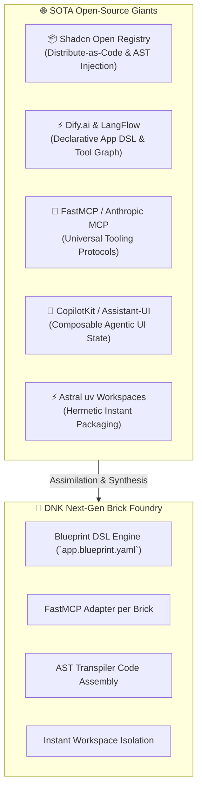

# --- DNK-MRH-HEADER ---
# mrh_id: "docs/architecture/SOTA_BRICK_FOUNDRY_ASSIMILATION_REPORT.md"
# purpose: "SOTA Open-Source Ecosystem Audit and Architectural Synthesis for Next-Generation DNK Brick Foundry."
# canonical_source: true
# alters_files: []
# triggers_tasks: []
# status: "Active"
# version: "1.0.0"
# updated_at: "2026-09-02"
# author: "Gerych (Hermes Prime) & Antigravity Orchestrator"
# --- END DNK-MRH-HEADER ---

# 🧬 SOTA Open-Source Research & Architectural Upgrade for DNK Brick System

## 🔍 Executive Research Summary
Using the `services/dnk_git_research` schema and the **Two-Track SOTA Assimilation Pipeline**, we surveyed world-class open-source architectures to identify patterns that elevate the **DNK Modular Brick Registry** from a static file assembler into an **autonomous, declarative AI Product Foundry**.

---

## 🏆 Top 5 Open-Source Architectural Benchmarks



| Project / Ecosystem | License / Track | Core Pattern to Assimilate | Impact on DNK Bricks |
| :--- | :--- | :--- | :--- |
| **1. Shadcn UI Registry Engine** | MIT *(Track 1)* | **Distribute-as-Code & Registry Manifests**: Components aren't rigid black-box npm packages; they are distributed as raw AST code with dependency metadata. | Bricks can inject tailor-made components directly into client applications without bloated dependencies. |
| **2. Dify.ai (`app.dsl.yaml`)** | Apache 2.0 *(Track 1)* | **Universal Application DSL**: Complete multi-agent applications, node pipelines, and model settings are serialized into a single portable YAML blueprint. | Enables 1-click export/import of entire DNK OS products as declarative blueprints. |
| **3. FastMCP / Model Context Protocol** | MIT *(Track 1)* | **Standardized Agent-to-Service Bridge**: Exposes internal service capabilities as standardized JSON-RPC/SSE tool endpoints. | Every Brick instantly becomes a plug-and-play MCP tool accessible by any LLM or UI node. |
| **4. CopilotKit / Assistant-UI** | MIT *(Track 1)* | **Bidirectional UI-Agent State Sync**: Composable React hooks (`useCopilotReadable`, `useCopilotAction`) for realtime canvas & app interaction. | Connects Brick 3 (Canvas) and Brick 6 (Web UI) with agent backends seamlessly. |
| **5. Astral `uv` Workspaces** | Apache 2.0 *(Track 1)* | **Hermetic Fast Virtualenvs & Lockfile Pruning**: Sub-millisecond dependency resolution and dynamic monorepo subset locking. | Exported standalone apps boot instantly without manual pip overhead. |

---

## 🚀 3 Breakthrough Upgrades for DNK Brick System

### 1. The DNK Blueprint DSL (`app.blueprint.yaml`)
Instead of assembling apps purely via CLI arguments, introduce a declarative application blueprint:

```yaml
# Example: apps/blueprints/shopify_growth_studio.blueprint.yaml
app_id: "ai_shopify_growth_studio"
name: "AI Shopify Growth Studio"
version: "1.0.0"

bricks:
  - id: "brick_04_shopify_engine"
    config:
      default_theme: "reburn"
      ast_mode: "strict"
  - id: "brick_05_video_ai"
    config:
      fps: 30
      resolution: "1080x1920"
  - id: "brick_06_web_api_shell"
    config:
      auth_enabled: true

canvas_layout:
  initial_graph: "templates/ecommerce_growth_graph.json"
```

### 2. FastMCP Tool Interface per Brick
Every Brick manifest declares an MCP entrypoint. This allows Gerych or any subagent to interact with the Brick as a live toolset:
```yaml
# In brick.manifest.yaml:
entrypoints:
  mcp_server: "services.dnk_shopify.mcp_server:mcp"
```

### 3. AST-Level Smart Code Injection
Instead of copying fixed boilerplate files, the exporter parses `apps/api/main.py` and `apps/web/app/layout.tsx` using AST (Python `ast` / TypeScript Babel AST) and cleanly mounts only the routers and navigation tabs corresponding to the selected bricks.
