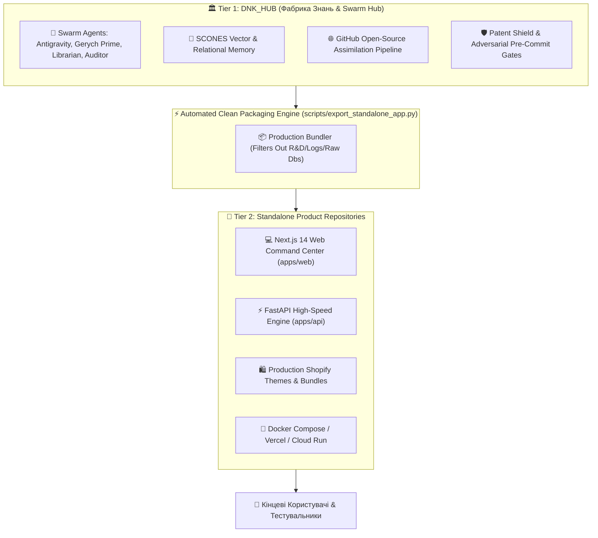

# --- DNK-MRH-HEADER ---
# mrh_id: "docs/architecture/TWO_TIER_DEVELOPMENT_PROTOCOL.md"
# purpose: "Official Two-Tier Development & Clean Distribution Protocol for DNK OS."
# canonical_source: true
# alters_files: []
# triggers_tasks: []
# status: "Active"
# version: "1.0.0"
# updated_at: "2026-09-01"
# author: "DNK-e.com Maksym"
# --- END DNK-MRH-HEADER ---

# 🏛️ DNK OS Two-Tier Architecture & Clean Distribution Protocol

## 1. Концептуальна модель (Two-Tier Model)

Система DNK OS розділена на два чітких функціональних рівні:



---

## 2. Розподіл обов'язків (Responsibilities)

### Рівень 1: `DNK_HUB` (R&D & Swarm Center)
- **Призначення:** Центр розробки, асиміляції світових opensource-технологій, накопичення пам'яті SCONES, тестування (1350+ тестів) та навчання агентів.
- **Дійові особи:**
  - **Antigravity (Mentor/Architect):** Задає стандарти, керує архітектурою та контролює якість.
  - **Герич (Gerych Prime - Swarm Builder):** Асимілює паттерни, генерує код, виправляє помилки.
  - **Herich Librarian:** Організовує документацію та базу знань.
  - **Auditor:** Проводить стрес-тести та верифікацію безпеки.

### Рівень 2: `DNKOS_APP` / Standalone Репозиторії (Клієнтський Продукт)
- **Призначення:** Чисті, легкі репозиторії (~30-50 MB), оптимізовані для швидкого розгортання (Vercel, Docker, Cloud Run) та тестування реальними користувачами.
- **Вміст:** Лише скомпільований продакшн-код без внутрішніх логів агентів, чернеток та R&D-скриптів.

---

## 3. Протокол генерації релізу (Release Generation)

Для генерації чистого проєкту використовується скрипт:
```bash
python3 scripts/export_standalone_app.py ../DNKOS_APP_STANDALONE
```

### Що автоматично включається в чистий репозиторій:
1. `apps/web/` — Next.js 14 фронтенд з Canvas V3, Liquid Inspector, Whiteboard.
2. `apps/api/` — FastAPI бекенд.
3. `services/dnk_shopify/` & `services/dnk_shopify_builder/` — Shopify 3.0 рушії та теми.
4. `services/dnk_video_ai_creator/` & `services/dnk_canvas_api/` — мікросервіси.
5. `core/` — ядро виконання.
6. `Dockerfile`, `Dockerfile.web`, `Dockerfile.api`, `docker-compose.yml`.
7. Чистий `.env.example` та автоматично ініціалізований `git` на гілці `main`.

---

## 4. Правила для агентів (Agent Invariants)
1. **Ніяких абсолютних шляхів (`/Users/...`):** Завжди використовувати відносні шляхи (`./`, `../`).
2. **Єдиний корінь `DNK_HUB`:** Будь-які вкладені дублюючі підпапки повністю видалені. Будь-які імпорти мають вигляд `import services...`, `import apps...`, `import core...`.
3. **Fail-Closed Pre-Commit Hook:** Перед кожним пушем або коммітом перевіряються лінтинг, відносні шляхи та цілісність тестів.
