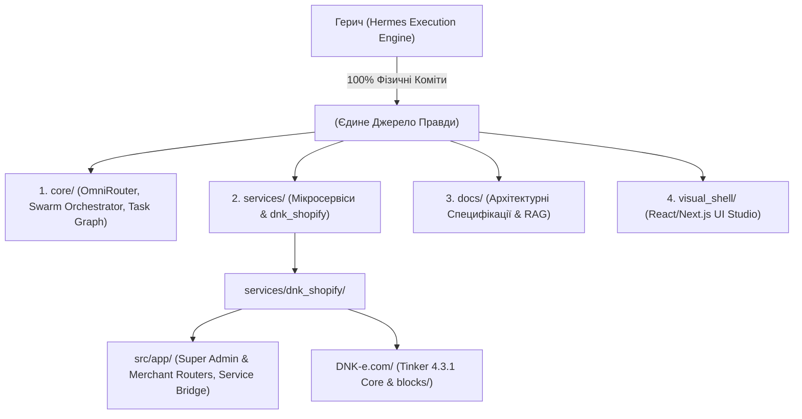

# --- DNK-MRH-HEADER ---
# mrh_id: "docs/tech/ARCH_02_MVP_Master_Plan.md"
# purpose: "Canonical documentation and task tracking note"
# canonical_source: true
# alters_files: []
# triggers_tasks: []
# status: "Active"
# version: "1.0.0"
# updated_at: "2026-08-09"
# --- END DNK-MRH-HEADER ---

# 🏛️ Канонічна Архітектура Нової Версії DNK OS MVP 0.1.0 у директорії DNK OS

Цей документ зафіксовує **єдине джерело правди (Single Source of Truth)** для нової версії продукту **DNK OS MVP 0.1.0**. 

Уся інфраструктура, кодова база, REST API роутери, React/Next.js UI компоненти та еталонна тема **DNK Ecom (T Core / v0.1.0)** розгортаються **ВИКЛЮЧНО у директорії `DNK_HUB/`**.

---

## 🏛️ Канонічна Структура Директорії `DNK_HUB/`

---

## 📑 5 Фундаментальних Правил Чистоти Інфраструктури

### 1. Повна Локалізація у `DNK_HUB/`
- Жоден новий файл додатка не розгортається у застарілі зовнішні директорії.
- Сервіс створення магазинів розміщується строго за шляхом: `services/dnk_shopify/`.

---

### 2. Повторне Використання 6 Місяців Напрацювань та Блискучої Бази Знань
- Асимільовані знання (Tinker 4.3.1 Horizon architecture, Open Design Token Transpiler, Universal Commerce Protocol UCP, Nova Poshta 1-Click Checkout Proxy, Volume Discounts) переносяться у `services/dnk_shopify/` як випробувані, 100% пройдені атоми.

---

### 3. Єдина Еталонна Тема: `DNK Ecom v0.1.0 (T Core)`
- Тема розгортається у `services/dnk_shopify/DNK-e.com/`.
- Використовує **95 атомарних Horizon-блоків** у `blocks/` з підтримкою нових тегів Shopify `` та ``.

---

### 4. Двохпанельний UI Studio у `visual_shell/`
- **Super Admin Studio**: Двохпанельний Diff-редактор для асиміляції донорів з GitHub/Figma та декомпозиції 2.0 тем у Horizon-блоки.
- **Merchant Launchpad**: 3-кроковий майстер Vibe Coding під нішу з 1-Click деплоєм у Shopify Admin.

---

### 5. Суворий Розподіл Ролей (Mentor vs Execution)
- **Antigravity (Ментор & Головний Архітектор)**: Формує архітектурні мапи, перевіряє цілісність системи, пише специфікації у `docs/tech/` та готує Промпти. **Нуль прямого редагування коду**.
- **Hermes (Герич)**: Фізично виконує 100% маніпуляцій з файлами у `DNK_HUB/`, реалізує Python/Liquid/JS код, запускає `pytest` та робить коміти в Git.