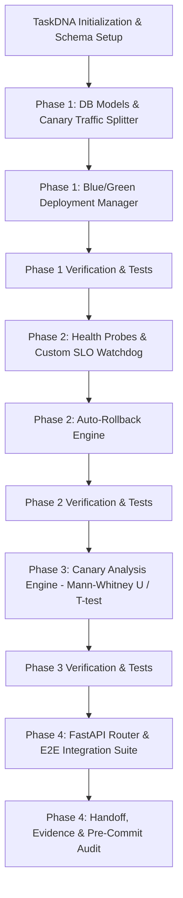

# --- DNK-MRH-HEADER ---
# mrh_id: "docs_tech_specs_dnk_platform_scale_004_blue_green_canary_deployment_spec"
# purpose: "Technical Specification & TaskDNA for Zero-Downtime Blue/Green & Canary Deployment Pipeline (DNK-PLATFORM-SCALE-004)"
# author: "DNK-e.com Maksym"
# license: "DNK-INTERNAL"
# canonical_source: true
# alters_files: []
# triggers_tasks: []
# status: "Active"
# version: "1.0.0"
# updated_at: "2026-08-28"
# --- END DNK-MRH-HEADER ---

# DNK-PLATFORM-SCALE-004: Zero-Downtime Blue/Green & Canary Deployment Pipeline

## 🎯 Executive Summary
DNK-PLATFORM-SCALE-004 implements an automated, fault-tolerant Blue/Green and Canary deployment orchestrator for DNK OS services. The engine integrates with Nginx Ingress, Istio Service Mesh, and custom application-level ingress routers to perform progressive traffic shifting (1% -> 5% -> 25% -> 50% -> 100%), statistical metric verification (Mann-Whitney U / T-test), real-time SLO violation detection, and automated zero-downtime rollback.

---

## 🧬 Evolutionary TaskDNA DAG

---

## 📊 Core Architecture Components

1. **Traffic Splitting Engine (`canary_traffic_splitter.py`)**:
   - Deterministic client hashing for sticky canary sessions.
   - Dynamic weight routing across Blue and Green clusters.
   - Nginx annotations / Istio VirtualService configuration generator.

2. **Blue/Green Lifecycle Orchestrator (`blue_green_deployment_manager.py`)**:
   - Environment provisioning and state transitions (INACTIVE -> DEPLOYING -> ACTIVE -> ROLLING_BACK).
   - Multi-step progression (1% -> 5% -> 25% -> 50% -> 100%).
   - Zero-downtime active switchover with connection draining.

3. **Health Probes & SLO Watchdog (`health_probe_evaluator.py`)**:
   - Liveness, Readiness, Startup, and Custom SLO metric probes (p95/p99 latency, 5xx error rate).
   - Continuous evaluation against defined thresholds.

4. **Canary Statistical Analysis (`canary_analysis_engine.py`)**:
   - Statistical hypothesis testing (Mann-Whitney U and Independent Two-Sample T-test) comparing baseline (Blue) and candidate (Green) distributions.
   - Automated promotion recommendations (`promote`, `rollback`, `wait`).

5. **Instant Auto-Rollback Engine (`auto_rollback_engine.py`)**:
   - Real-time circuit breaker triggering 100% traffic diversion to stable Blue upon SLO breach.

6. **FastAPI Endpoints & Telemetry Router (`platform_canary_deployment.py`)**:
   - Complete REST API for deployment configs, environments, triggers, probes, analysis, and audit events.
