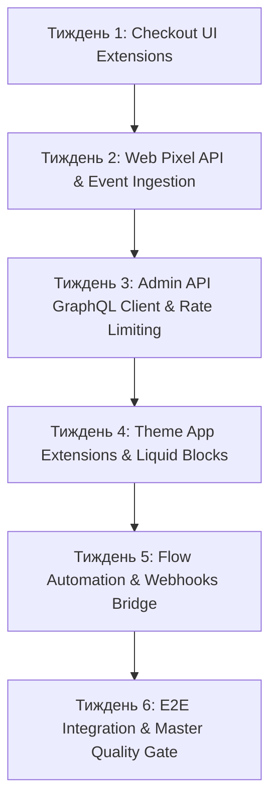

# --- DNK-MRH-HEADER ---
# mrh_id: "SPEC-DNK-SHOPIFY-001"
# purpose: "TaskDNA Architecture Specification for Shopify App Bridge 2.0 MVP Integration"
# canonical_source: true
# alters_files: []
# triggers_tasks: []
# status: "Active"
# version: "1.0.0"
# updated_at: "2026-08-28"
# author: "DNK-e.com Maksym & Gerych Builder"
# --- END DNK-MRH-HEADER ---

# 🛍️ TaskDNA Specification: Shopify App Bridge 2.0 MVP (DNK-SHOPIFY-001)

## 📌 Executive Summary
`DNK-SHOPIFY-001` визначає архітектуру та план впровадження **Shopify App Bridge 2.0 MVP** для екосистеми DNK OS. Ця інтеграція надає прямий міст між 14-агентним Swarm Runtime, Generative UI Engine та Shopify Storefront/Admin API версії `2024-07` / `2024-10`.

---

## 🏗️ 1. Архітектурні Модулі & Інтеграції

### 1.1 Checkout UI Extensions (`dnk_shopify` + `gerych_builder`)
- **Dynamic Upsell / Cross-Sell Blocks**: контекстна пропозиція супутніх товарів на основі аналізу кошика через AI Agent.
- **Loyalty & Points Redemption**: відображення персональних знижок та балансу бонусних балів у режимі реального часу.
- **Post-Purchase Upsell Engine**: single-click upsell модальні вікна без повторного вводу платіжних реквізитів.

### 1.2 Web Pixel API (`dnk_shopify` + `dnk_analytics_agent`)
- **Event Tracking Pipeline**: асинхронний збір подій `page_view`, `search_submitted`, `product_viewed`, `cart_viewed`, `checkout_started`, `payment_info_submitted`, `purchase`.
- **Privacy & GDPR Compliance**: автоматичне очищення PII (Personally Identifiable Information) перед передачею в аналітичну шину DNK OS.

### 1.3 Admin API GraphQL Engine (`dnk_shopify` + `dnk_dev_fullstack`)
- **GraphQL Client & Rate Limiter**: токен-бакет алгоритм з лімітом 1,000 токенів/хв на магазин з burst-лімітом 50.
- **Bi-directional Entity Sync**: синхронізація каталогів (`Products`, `Variants`, `Inventory`, `Collections`), замовлень (`Orders`, `DraftOrders`) та клієнтів (`Customers`).

### 1.4 Theme App Extensions & Generative UI (`dnk_shopify` + `Generative UI Engine`)
- **Liquid App Blocks**: автоматична генерація та валідація `.liquid` блоків для сучасних Shopify Online Store 2.0 тем.
- **Embedded Admin Dashboard**: інтерфейс керування додатком на базі `@shopify/app-bridge-react`, Next.js 15 та Tailwind v4.

### 1.5 Shopify Flow Automation Engine (`dnk_shopify` + `dnk_ops_agent`)
- **Triggers & Actions**: експорт кастомних тригерів (наприклад, `DNK High Fraud Risk Detected`, `DNK AI Replenishment Recommended`).
- **Webhooks Dispatcher**: обробка підписаних HMAC-SHA256 вебхуків від Shopify.

---

## 🧬 2. Еволюційний Граф Завдань (5-Тижневий Спринт)

---

## 🔒 3. Безпека, Верифікація та Rate Limiting
- **HMAC Verification**: валідація кожного вхідного вебхука через `X-Shopify-Hmac-SHA256`.
- **Token Vault Isolation**: збереження мерчант-токенів у `apps/api/routers/secrets_vault.py`.
- **Adversarial Gate**: перевірка відсутності вразливостей AST та ASR < 5.0%.

---

## 🧪 4. Критерії Готовності (Definition of Done)
1. 100% тестів у `tests/shopify/` проходять успішно (Regression + Integration).
2. Rate Limiter витримує навантаження без 429 Too Many Requests.
3. Master Quality Gate (`bash scripts/verify_all.sh`) видає 100% Green.
