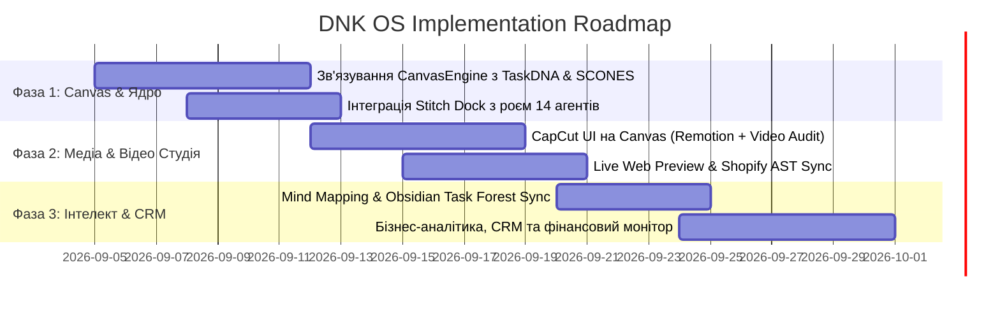

<!-- --- DNK-MRH-HEADER ---
mrh_id: "obsidian/DNK_HUB/002 DNK OS - Master System Architecture & Implementation Blueprint.md"
purpose: "Comprehensive Architectural Specification and Implementation Blueprint for DNK OS Infinite Node-Based Agentic Canvas."
canonical_source: true
alters_files: []
triggers_tasks: []
status: "Active"
version: "1.0.0"
updated_at: "2026-09-04"
author: "DNK-e.com Maksym & Gerych Prime"
--- END DNK-MRH-HEADER -->

-->

# 🌌 002 DNK OS: Генеральна архітектура та План реалізації Агентної Системи

> [!abstract] **Візія та Мета**
> **DNK OS** — це наступне покоління персональної агентивної операційної системи для управління проєктами користувача, що базується на **Infinite Node-Based Canvas** (натхненному *Google Stitch* та *CapCut AI Design*). Вона об'єднує глибоку пам'ять користувача і проєктів, 14 спеціалізованих агентів рою, миттєву кодогенерацію компонентів, мультимодальний аналіз медіа (відео/аудіо), Shopify-екосистему, бізнес-аналітику та візуальний Mind Mapping у єдине робоче полотно.

---

## 🗺️ 1. Візуальна концепція: Симбіоз Google Stitch та CapCut AI Design

```
+---------------------------------------------------------------------------------------------------------+
|  DNK OS TOP NAV: [Workspace: Alpha-001] [Active Project: Ecom D2C] [User: Maxim] [Swarm: 14 Active]    |
+---------------------------------------------------------------------------------------------------------+
|                                    INFINITE NODE-BASED CANVAS                                            |
|                                                                                                         |
|   [Idea / MindMap Node] --------> [TaskDNA DAG Node] --------> [Web Component Node (Live Preview)]      |
|            |                                |                                   |                       |
|            v                                v                                   v                       |
|   [SCONES Knowledge Node]         [Swarm Delegation Node]             [Shopify Storefront Sync]         |
|   (Context & User Soul)           (Builder + Auditor)                                                   |
|                                             |                                                           |
|                                             v                                                           |
|                                   [Media / Video Node]                                                  |
|                                   (CapCut style: Remotion +                                             |
|                                    Video Audit + Sidecar)                                               |
|                                                                                                         |
|  +---------------------------------------------------------------------------------------------------+  |
|  | Stitch Floating Spatial Dock: [Select] [Add Node] [AI Prompt] [Swarm Run] [Audit] [Render/Export] |  |
|  +---------------------------------------------------------------------------------------------------+  |
+---------------------------------------------------------------------------------------------------------+
| LEFT PANEL: Stitch Chat & Task Forest       | RIGHT PANEL: Live Inspector, Code AST & Video Timeline     |
+---------------------------------------------------------------------------------------------------------+
```

---

## 🏛️ 2. Матриця 11 Ключових Можливостей та їх прив'язка до DNK_HUB

| №      | Вимога Користувача                                                    | Архітектурний Модуль DNK OS                         | Реалізація в DNK_HUB (Existing Assets)                                                                                                    |
| ------ | --------------------------------------------------------------------- | --------------------------------------------------- | ----------------------------------------------------------------------------------------------------------------------------------------- |
| **1**  | **Кабінет і Пам'ять користувача** (голос, стиль, характер, побажання) | `UserSoulEngine` + `UserMemoryProfile`              | `core/user_soul.py`, `core/scones_memory.py`, `apps/web/components/cabinet/`, `apps/api/routers/cabinet.py`                               |
| **2**  | **Проєкти, памʼять проєктів, дизайн-система**                         | `ProjectIsolationEngine` + `DesignTokenSynthesizer` | `apps/api/routers/workspace`, `.dnk_active_project.env`, `core/workspace/`, `apps/web/components/workspace/`                              |
| **3**  | **Рій адаптивних агентів** (Swarm Adaptation)                         | `SwarmOrchestrator` (14 агентів під задачу)         | `core/swarm_engine.py`, `core/swarm_orchestrator.py`, `core/orchestrator/agents/`, `dnk_swarm_*`                                          |
| **4**  | **Генерація веб-компонентів та медіа** (фото, відео, код)             | `LiveComponentEngine` + `MediaStudio`               | `apps/web/components/canvas/LiveWebPreviewNode.tsx`, `RemotionPlayer.tsx`, `packages/video-audit-core/`, `services/dnk_video_ai_creator/` |
| **5**  | **Контекстне ін'єктування знань** (Scoped Context DAG)                | `TaskDNAContextRouter`                              | `core/dna_assimilation.py`, `core/task_engine.py`, `apps/web/components/taskdna/`, `services/dnk_canvas_api/`                             |
| **6**  | **Навчання та агрегація знань** (Ієрархія L1-L3 + Самонавчання)       | `SCONES L1/L2/L3` + `ErrorDistiller`                | `core/scones_memory.py`, `core/scones_l3_memory.py`, `core/error_distillation/`, Obsidian Vault Bidirectional Sync                        |
| **7**  | **Аудит та розуміння відео/соцмереж** (відео, фото, аудіо)            | `VideoAuditEngine`                                  | `packages/video-audit-core/` (Sidecar caching, frame deduplication, niche adaptation, hook/retention audit)                               |
| **8**  | **Веб-скрапінг та реверс-інжиніринг сайтів**                          | `WebIntelligence` + `AST Reverse`                   | `services/dnk_web_research/`, `services/dnk_git_research/`, `core/dna_assimilation.py`, Browser Use MCP                                   |
| **9**  | **Shopify-магазини та бізнес-інструменти**                            | `ShopifyStorefrontEngine`                           | `services/dnk_shopify/`, `services/dnk_shopify_builder/`, `apps/shopify/`, `apps/web/components/canvas/ShopifyCanvasSyncBar.tsx`          |
| **10** | **Аналітика бізнесу, маркетингу, CRM**                                | `AnalyticsIntelligence` + `AgenticCRM`              | `apps/web/components/analytics/`, `apps/api/routers/analytics`, `core/accounting_engine.py`                                               |
| **11** | **Mind Mapping, збереження ідей та граф задач**                       | `InfiniteCanvasEngine` + `TaskForest`               | `apps/web/components/canvas/` (`CanvasEngine.tsx`, `ConnectedCanvasEngine.tsx`, `StitchSpatialToolbar.tsx`, `SwarmTaskForestBoard.tsx`)   |

---

## ⚡ 3. Деталізація Модулів Системи

### 1. Кабінет Користувача & User Soul (`core/user_soul.py`)
- **Tone-of-Voice & Personality**: фіксація індивідуального стилю спілкування Максима (темперамент, лаконічність, мовні інваріанти).
- **Brand Kit**: кольори бренду, типографіка, логотипи, правила айдентики, які автоматично підтягуються у веб- та відеогенератори.
- **Global Memory Invariants**: збереження особистих та операційних пріоритетів через SCONES L1.

### 2. Мультипроєктна ізоляція та Дизайн-Система
- Кожен проєкт має власний простір: `.dnk_active_project.env`, scoped SQLite/PostgreSQL сховище, ізольовані папки ассетів.
- Автоматичний експорт CSS Variables / Tailwind Preset під проєкт.
- Специфічний контекст проєкту (мета, ЦА, конкуренти, продуктові лінійки).

### 3. Infinite Node-Based Canvas (Stitch + CapCut)
- **Головне полотно**: реалізоване на основі `apps/web/components/canvas/ConnectedCanvasEngine.tsx`.
- **Типи Нод**:
  1. `IdeaNode / MindMapNode` — текстові та візуальні думки, зв'язані зв'язками деревоподібної структури.
  2. `TaskDNANode` — еволюційний крок завдання, який виконує конкретний агент.
  3. `LiveWebPreviewNode` — пісочниця з рендером згенерованого React/Tailwind коду.
  4. `RemotionVideoNode` — таймлайн, прев'ю відео, аудіо-доріжки, титри (CapCut-стиль).
  5. `ShopifySectionNode` — живий блок теми Shopify з переглядом Liquid AST.
  6. `AuditReportNode` — результати перевірки відео або сайту.
- **Панель керування**: `StitchSpatialToolbar.tsx` та `StitchFloatingDock.tsx` для швидкого виклику агентів.

### 4. Мультимодальний Відео-Аудит (`packages/video-audit-core`)
- Автоматичний розбір Reels / TikTok / YouTube Shorts:
  - **Hook Efficiency**: аналіз перших 3 секунд (візуальний та аудіо-гачок).
  - **Frame Deduplication & Sidecar Caching**: збереження кешу розпізнаних кадрів для скорочення витрат токенів у 10 разів.
  - **Niche Adaptation**: оцінка під нішу (E-commerce, Tech, EdTech).
  - **Audio Transcription & Voiceover**: вилучення субтитрів, оцінка темпу мови.

### 5. Shopify & E-Commerce Integration
- Безшовна трансляція компонентів з полотна безпосередньо в Shopify Theme OS 2.0.
- Перевірка валідності Liquid через `dnk_shopify_validate_liquid`.
- Двосторонній зв'язок: зміна ноди на Canvas оновлює відповідну секцію в Shopify-темі.

### 6. Знання, SCONES та Самонавчання
- **L1**: Швидкий контекст (активний агент + активна нода на Canvas).
- **L2**: Векторний пошук рішень та успішних шаблонів (Qdrant/Chroma/PostgreSQL).
- **L3**: Довгостроковий семантичний граф взаємозв'язків проєктів, клієнтів та ідей.
- **Error Distillation**: будь-яка помилка збірки чи лінтування коду автоматично фіксується і стає вакциною для рою.

---

## 🚀 4. Еволюційний План Реалізації (Roadmap)



### Фаза 1: Консолідація Полотна (Infinite Canvas & Swarm Bridge)
- Запуск єдиного UI на базі `apps/web/components/canvas/ConnectedCanvasEngine.tsx`.
- Прив'язка виклику `dnk_swarm_dispatch` до нод полотна.
- Активація `UserSoul` та профілю Максима при кожному старті сесії.

### Фаза 2: Мультимодальна Генерація (Web + Video + Shopify)
- Вбудовування `packages/video-audit-core` та `RemotionPlayer` безпосередньо у ноди полотна для швидкого монтажу відео.
- Активація генерації веб-компонентів у `LiveWebPreviewNode` з миттєвим перемиканням у Shopify Liquid.

### Фаза 3: Екосистема Знань, Mind Mapping та CRM
- Інтеграція двосторонньої синхронізації полотна з нотатками Obsidian (`dnk_obsidian_task_forest`).
- Запуск інтелектуальної CRM-ноди для управління лідами та проєктами користувача.

---

## 🔗 Зв'язані матеріали
- [[000 DNK HUB Index|Головний покажчик знань DNK HUB]]
- [[001 Obsidian & DNK OS Documentation Standard|Стандарт документації Obsidian]]
- [[Gerych Prime - Unified Orchestrator & SOTA Adaptation Engine|Маніфест Герича та Реєстр Агентів]]
- Репозиторій полотна: `apps/web/components/canvas/`
- Ядро відео-аудиту: `packages/video-audit-core/`
