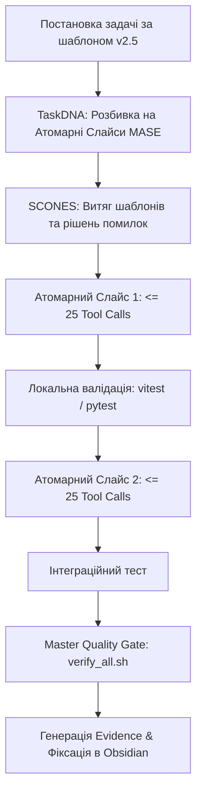

<!-- --- DNK-MRH-HEADER ---
mrh_id: "obsidian/DNK_HUB/004 Gerych Task Specification Standard & Zero-Waste Protocol v2.5.md"
purpose: "Canonical Knowledge Note for Task Specification Standard v2.5, MASE, and Zero-Waste Protocol for Humans and Swarm Agents."
canonical_source: true
alters_files: []
triggers_tasks: []
status: "Active"
version: "2.5.0"
updated_at: "2026-09-04"
author: "DNK-e.com Maksym, Antigravity & Gerych Prime"
--- END DNK-MRH-HEADER -->

-->

# 📋 004 Стандарт постановки задач для Герича та Zero-Waste Protocol v2.5

> [!abstract] **Призначення стандарту**
> Цей документ є канонічним керівництвом для постановки та делегування завдань у рої **DNK OS**. Він регламентує взаємодію між **Максимом** (Chief Visionary), **Antigravity** (Mentor / Architect) та **Геричем** (Gerych Prime / Swarm Manager). Дотримання стандарту гарантує **100% виконання завдань з першого проходу**, повне усунення зациклень та нульову втрату контексту чи бюджету інструментів.

---

## 🧭 Навігація та контекст
- **Головний покажчик (MOC)**: [[000 DNK HUB Index]]
- **Стандарт документації**: [[001 Obsidian & DNK OS Documentation Standard]]
- **Архітектурний маніфест Герича**: [[Gerych Prime - Unified Orchestrator & SOTA Adaptation Engine]]
- **Генеральна архітектура**: [[002 DNK OS - Master System Architecture & Implementation Blueprint]]
- **Репозиторний першоджерело**: `docs/templates/GERYCH_TASK_TEMPLATE.md`

---

## 🎯 1. Чому виник цей стандарт (Анатомія попередніх збоїв)

Під час глибокого аудиту робочих сесій Герича (сесії `20260904_140454_9cd136`, `20260904_154024_811492`, `20260904_180832_7508bf`) було виявлено чотири фундаментальні пастки, які призводили до зриву виконання або вичерпання ліміту (90/90 tool calls):

1. **Монолітні «супер-задачі»**: Постановка одночасно 3-4 великих підсистем (наприклад, одночасно писати API, UI Canvas, WebSocket стрімінг і тести) перевантажувала контекстне вікно, змушуючи агента крутитися в циклі виправлень.
2. **Аморфні орієнтири файлів**: Коли в задачі не вказано точні шляхи до файлів, агент витрачав до 30 кроків на хаотичний пошук через `grep`/`find`.
3. **Холості спроби патчів (Whitespace Mismatch)**: Спроби застосувати `replace_file_content` без попереднього читання точного діапазону рядків викликали помилки `TargetContent not found`.
4. **Ізоляція системного оточення**: Запуск системного `python3` замість ізольованого `.venv/bin/python` призводив до помилок імпорту сторонніх бібліотек.

> [!important] **Головне правило швидкості (Zero-Waste)**:
> Якість виконання задачі на 80% залежить від якості її формулювання. Чіткі межі, точні шляхи та атомарні кроки перетворюють Герича на надшвидкісний хірургічний інструмент.

---

## ⚡ 2. Ключові принципи Zero-Waste Protocol v2.5



### 1. Mandatory Atomic Slice Execution (MASE)
- Будь-яка задача обов'язково розбивається на **Атомарні Слайси** (Slice 1, Slice 2, Slice 3).
- **Жорсткий ліміт**: Не більше **25 викликів інструментів (tool calls)** на один слайс.
- Кожен слайс фокусується лише на 1–2 файлах, проходить швидку валідацію і фіксується.

### 2. Virtualenv SSOT (Single Source of Truth)
- Завжди використовується оточення `.venv` (`.venv/bin/python`, `.venv/bin/pytest`).
- Вбудований Pre-Tool Hook автоматично перенаправляє команди на віртуальне оточення, усуваючи конфлікти версій.

### 3. Context Diet (Дієта контексту)
- Заборонено читати великі файли цілком.
- Використовувати `view_file(StartLine, EndLine)` порціями по **80–120 рядків**.

### 4. Патчинг через обов'язкову інспекцію
- Перед викликом `replace_file_content` агент зобов'язаний переглянути цільовий діапазон рядків, щоб збігалися всі відступи та пробіли.

### 5. Universal Relative Path Invariant
- **Тільки відносні шляхи** (`./`, `../`, `apps/...`, `services/...`).
- Жодних абсолютних шляхів `/Users/...` у коді, тестах чи командах.

---

## 📄 3. Канонічний шаблон задачі для Герича (GERYCH_TASK_TEMPLATE v2.5)

Коли Максим або агент-ментор ставлять задачу Геричу, вона повинна мати такий вигляд:

```markdown
# 📋 TASK-DNK-[DOMAIN]-[YYYYMMDD]-[XXX]: [Назва задачі]

## 🎯 Метадані задачі
- **Task ID**: `TASK-DNK-[DOMAIN]-[YYYYMMDD]-[001]`
- **Domain**: `apps/visual_shell` | `services/dnk_*` | `core/*`
- **Primary Executor**: `gerych_builder` | `dnk_dev_fullstack` | `dnk_video_ai_creator`
- **Collaborating Agents**: `gerych_auditor`, `dnk_scones_memory`
- **Execution Mode**: `MUTATION` (зміна коду) або `READ_ONLY_AUDIT` (аналіз)
- **Budget Limit**: <= 25 tools на слайс

---

## 💡 1. Суть завдання та архітектурна мета
- **Поточний стан**: [Що є зараз і що не працює / чого не вистачає]
- **Очікуваний результат**: [Що має бути побудовано]
- **Explicit Non-Goals (Межі задачі)**:
  - ❌ Не чіпати супутні сервіси поза маніфестом.
  - ❌ Не змінювати існуючі стабільні тести без узгодження.

---

## 🗺️ 2. Маніфест цільових файлів (Target File Manifest)
| Дія | Точний відносний шлях | Відповідальність / Символи |
| :--- | :--- | :--- |
| `[NEW]` | `apps/visual_shell/src/components/...` | Компонент, хуки, типи |
| `[MODIFY]` | `services/dnk_canvas_api/...` | Ендпоінти, обробка подій |
| `[NEW]` | `tests/verification/test_...py` | Верифікаційні тести |

---

## 🧩 3. Атомарні слайси виконання (MASE)

### 🔹 Слайс 1: Базова реалізація (Scaffolding)
- **Файли**: [1-2 файли]
- **Команда перевірки**: `npx tsc --noEmit` або `.venv/bin/pytest tests/...`
- **Бюджет**: <= 20 tool calls

### 🔹 Слайс 2: Інтеграція та підключення до шини подій
- **Файли**: [1-2 файли]
- **Команда перевірки**: `npx vitest run apps/...`
- **Бюджет**: <= 20 tool calls

### 🔹 Слайс 3: Фінальна сертифікація якості
- **Команда**: `bash scripts/verify_all.sh`
- **Генерація Evidence**: `python3 scripts/system/generate_evidence.py ...`
- **Бюджет**: <= 10 tool calls

---

## 🧠 4. Контекст SCONES та відомі граблі
- **Що запитати в SCONES**: `scones_get_memories(query="...")`
- **Відомі помилки**:
  - Імпорт `RuntimeEventBus` виконувати з `core.runtime_events`.
  - Перед правкою файлу зробити `view_file` для звірки відступів.

---

## 🛡️ 5. Команди перевірки (Quality Gate)
```bash
# Локальний юніт-тест:
.venv/bin/pytest tests/verification/test_target.py -v

# Master Quality Gate (Обов'язково перед звітом):
bash scripts/verify_all.sh
```

---

## ✅ 6. Definition of Done (Критерії готовності)
- [ ] Всі слайси завершено без пропущених вимог.
- [ ] Жодних абсолютних шляхів `/Users/...`.
- [ ] Валідний заголовок DNK-MRH у всіх нових файлах.
- [ ] `scripts/verify_all.sh` показує 100% Green (1520+ passed).
- [ ] Звіт передано Максиму українською мовою з активними посиланнями.
```

---

## 👥 4. Матриця розподілу ролей у рої

Кожен підрозділ рою відповідає за свою специфіку:

| Агент рою | Зона відповідальності | Типові завдання |
| :--- | :--- | :--- |
| **`gerych_prime`** 👑 | Верховна координація, розподіл задач | Декомпозиція TaskDNA, запуск MASE-слайсів |
| **`gerych_builder`** 🎨 | Canvas UI, React, Tailwind, Frontend | Побудова візуальних нод, таймлайну, шторки |
| **`dnk_dev_fullstack`** ⚙️ | FastAPI, SQLAlchemy, WebSocket Gateway | Стрімінг подій, REST API, міграції БД |
| **`dnk_video_ai_creator`** 🎬 | Remotion v5, фізика пружин, рендеринг | Компіляція сторіборду у відео-композиції |
| **`dnk_shopify`** 🛍️ | Liquid AST, Checkout Extensions | Теми Shopify, Storefronts, e-commerce логіка |
| **`gerych_auditor`** ⚔️ | Adversarial Review, валідація шлюзу | Запуск `verify_all.sh`, аудит безпеки, перевірка DoD |
| **`dnk_scones_memory`** 🧠 | Семантична пам'ять, шаблони рішень | Пошук у базі знань, реєстрація нових рецептів |
| **`herich_librarian`** 📚 | Документація, MRH-стандарти, Obsidian | Фіксація нотаток, синхронізація MOC-індексу |

---

## 💡 5. Пам'ятка для Максима (Як поставити задачу за 60 секунд)

> [!tip] **Експрес-формула ідеальної задачі**:
> 1. Вкажи **мету** (що має працювати після завершення).
> 2. Вкажи **1-3 цільові файли** (де саме писати код).
> 3. Вкажи **як перевірити** (який тест запустити).
> 4. Додай магічну фразу: **«Працюй за шаблоном v2.5 та протоколом MASE»**.
>
> Цього достатньо, щоб Герич автоматично вибрав потрібний режим, розбив роботу на слайси до 25 інструментів та здав результат із зеленою перевіркою `verify_all.sh`.

---

## 🔗 Зв'язані документи та стандарти
- [[000 DNK HUB Index]] — Головний навігатор бази знань
- [[001 Obsidian & DNK OS Documentation Standard]] — Правила оформлення та формати нотаток
- [[002 DNK OS - Master System Architecture & Implementation Blueprint]] — Генеральний архітектурний план
- [[003 Remotion Compiler & Canvas Runtime Bridge Protocol]] — Реалізація мосту відео-компілятора
- [[Gerych Prime - Unified Orchestrator & SOTA Adaptation Engine]] — Ядро Герича
