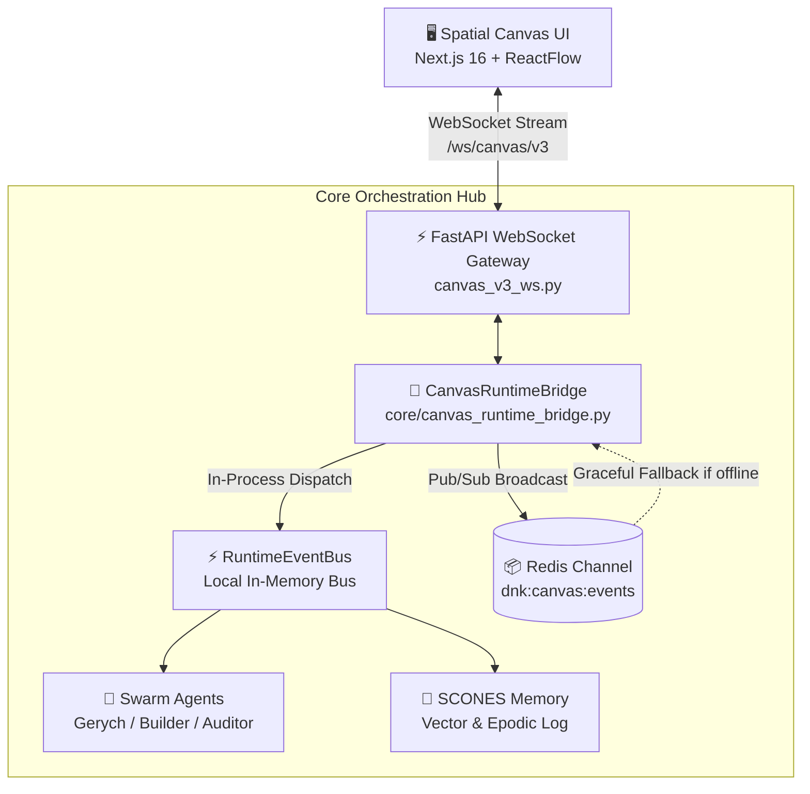

<!-- --- DNK-MRH-HEADER ---
mrh_id: "obsidian/DNK_HUB/02_Architecture/ADR_0042_Canvas_Runtime_Bridge_WebSocket_Integration.md"
purpose: "Architectural Decision Record for Canvas Runtime Bridge, Dual EventBus/Redis Pub-Sub Topology, Clean-Room Remotion v5 Math, and Offline Graceful Fallback."
canonical_source: true
alters_files: []
triggers_tasks: []
status: "Active"
version: "1.0.0"
updated_at: "2026-09-04"
author: "DNK-e.com Maksym & Gerych Prime"
--- END DNK-MRH-HEADER -->

-->

# 🏛️ ADR 0042: Canvas Runtime Bridge & WebSocket Integration Architecture

> [!abstract] **Executive Summary**
> Цей ADR фіксує архітектурне рішення щодо створення реактивного, двонаправленого середовища синхронізації між візуальним безкінечним полотном (**DNK Spatial Canvas**), фоновими AI-агентами Swarm та бекенд-сервісами через компонент `CanvasRuntimeBridge`. Рішення базується на гібридній топології **Dual EventBus / Redis Pub-Sub**, чистій покадровій математиці **Remotion v5** та автоматичному **Offline Graceful Fallback** без втрати подій.

---

## 👤 Частина 1: Для Максима (Контекст, Проблема та Рішення)

### ❓ Проблема: Чому виникла потреба в ADR 0042?
Коли користувач або AI-агент взаємодіє з візуальними нодами на полотні (наприклад, переміщує ноду відео, виділяє групу нод `PhotoStudioNode` та `VideoCreatorNode`, або запускає генерацію відеоролика), виникає три критичні виклики:
1. **Затримка зворотного зв'язку (Latency & Blind Execution):** Якщо запуск фонової задачі агента відбувається через класичний REST API (`POST /execute`), клієнтський UI залишається "сліпим" до проміжних фаз виконання (підготовка кадрів, виклик LLM, композиція сцени).
2. **Множинні споживачі подій (Multi-Consumer Fan-Out):** Подія створення або зміни ноди потрібна одночасно:
   - браузеру поточного користувача (для реактивного рендерингу стану);
   - іншим підключеним клієнтам у колаборативному режимі;
   - внутрішнім підсистемам пам'яті (`SCONES Memory`, аудит телеметрії);
   - фоновим воркерам рою (`dnk_video_ai_creator`, `dnk_shopify`).
3. **Залежність від зовнішньої інфраструктури (Redis Dependency):** У локальному середовищі розробки, під час офлайн-роботи чи запуску швидких тестів відсутність працюючого кластера Redis не повинна ламати працездатність додатку або блокувати інтерфейс.

### 💡 Прийняте рішення: Гібридний міст `CanvasRuntimeBridge`
Ми відмовилися від жорсткої прив'язки виключно до Redis чи виключно до локального EventEmitter на користь **подвійної паралельної шини подій**:
- **Локальна шина (`RuntimeEventBus`):** Внутрішньопроцесна пам'ять, нульовий оверхед мережі, миттєве сповіщення підписників у межах того самого процесу Python/FastAPI.
- **Розподілена шина (`Redis Pub/Sub`):** Канал `dnk:canvas:events` для горизонтального масштабування між окремими інстансами FastAPI, WebSocket-гейтвеями та розподіленими воркерами.
- **Повна стійкість до збоїв мережі (Offline Graceful Fallback):** `CanvasRuntimeBridge` виконує перевірку доступності Redis з тайм-аутом `0.5s`. Якщо Redis недоступний, міст непомітно перемикається в локальний режим, буферизує повідомлення в пам'яті та продовжує роботу без жодної помилки для користувача.



---

## 🤖 Частина 2: Технічна специфікація та математика (Technical Specification)

### 1. Dual EventBus & Redis Pub-Sub Topology
Міст `CanvasRuntimeBridge` інкапсулює подвійне публікування з контролем порядкових номерів (`sequence`):

```python
class CanvasRuntimeBridge:
    def __init__(
        self,
        event_bus: Optional[RuntimeEventBus] = None,
        redis_client: Optional[Any] = None,
        redis_host: str = "localhost",
        redis_port: int = 6379,
        redis_channel: str = "dnk:canvas:events",
        default_tenant_id: str = "default",
        default_workspace_id: str = "default",
        default_canvas_id: str = "default",
    ) -> None:
        ...
```

#### Ключові події життєвого циклу ноди:
1. `publish_node_created(node_id, node_type, position, data)` ➔ `node.created`
2. `publish_node_updated(node_id, data_patch)` ➔ `node.updated`
3. `publish_node_executed(node_id, status, error, output)` ➔ `node.executed`
4. `publish_selection_executed(selection_id, target_node_ids, execution_type)` ➔ `selection.executed`
5. `publish_graph_snapshot(snapshot)` ➔ `graph.snapshot`

### 2. Clean-Room Remotion v5 Math Specification
При компіляції та динамічному узгодженні тривалості відеосцен на канвасі використовується сувора покадрова математика стандарту **Remotion v5**:

$$\text{fps} = 30 \quad (\text{DNK Standard Frames Per Second})$$

$$\text{durationInFrames} = \text{round}(\text{durationInSeconds} \times \text{fps})$$

#### Формула пружинної анімації (Spring Damping Physics):
$$F_s = -k \cdot x - c \cdot v$$
де:
- $k$ — жорсткість пружини (`stiffness`, типово $100$ для плавних входів, $200$ для snappy-акцентів);
- $c$ — демпфування (`damping`, типово $10$ для запобігання нескінченних осциляцій);
- $m$ — маса (`mass`, типово $0.5 - 1.0$).

#### Безпечна нормалізація покадрової інтерполяції (Clamped Interpolation):
$$v_{\text{clamped}}(f) = \min(\max(v(f), \text{outputMin}), \text{outputMax})$$
Всі інтерполяції використовують конфігурацію:
```typescript
interpolate(frame, [startFrame, endFrame], [0, 1], {
  extrapolateLeft: 'clamp',
  extrapolateRight: 'clamp',
})
```
Це повністю унеможливлює артефакти "вильоту" елементів за межі кадру при виході за часові межі сцени.

### 3. Offline Graceful Fallback Protocol
Властивість стійкості реалізована за принципом Non-Blocking Circuit Breaker:
- При старті здійснюється `socket_connect_timeout=0.5`.
- У разі виникнення `redis.ConnectionError` або таймауту статус `redis_connected` встановлюється в `False`.
- Події продовжують записуватися в локальний буфер `published_events` та `redis_published_messages`, гарантуючи відсутність `UnhandledExceptions` у клієнтському потоці.
- Після відновлення зв'язку з Redis подальші виклики автоматично відновлюють відправку в канал.

---

## ⚖️ Порівняльний аналіз альтернатив (Options Matrix)

| Критерій | Варіант A: Тільки Redis | Варіант B: Тільки WebSocket In-Memory | Варіант C: Гібрид `CanvasRuntimeBridge` (Обрано) ✅ |
| :--- | :--- | :--- | :--- |
| **Офлайн розробка** | ❌ Вимагає запущеного демона Redis | ✅ Працює без інфраструктури | ✅ **Автоматичний fallback на in-memory** |
| **Тестова ізоляція** | ⚠️ Потрібні mock-об'єкти або live db | ✅ Швидкі unit-тести | ✅ **Zero-mock in-memory тести, 100% green** |
| **Горизонтальне масштабування** | ✅ Підтримує N воркерів | ❌ Обмежено одним процесом | ✅ **Redis Pub/Sub для кластера** |
| **Синхронність локальних агентів** | ⚠️ Затримка мережевого сокета | ✅ Прямий виклик функцій | ✅ **Миттєвий EventBus для локального рою** |

---

## 🛡️ Інваріанти та Правила для розробників
1. **Zero-Crash Invariant**: Жоден збій Redis не повинен переривати WebSocket з'єднання користувача чи викликати 500 помилку.
2. **Relative Path Hygiene**: Всі імпорти та конфігураційні шляхи використовують виключно відносні шляхи (`./`, `../`).
3. **MRH Header**: Будь-які модифікації файлів мосту обов'язково супроводжуються оновленням `DNK-MRH-HEADER`.
4. **Clean Code-as-Video**: Будь-який код, що генерується для Remotion, повинен компілюватися без зовнішніх недекларованих залежностей.

---

## 🔗 Зв'язки з іншими документами (Wikilinks)
- [[000 DNK HUB Index]] — Головна навігаційна карта сховища.
- [[001 Obsidian & DNK OS Documentation Standard]] — Правила оформлення та ведення нотаток.
- [[002 DNK OS - Master System Architecture & Implementation Blueprint]] — Загальна архітектура системи.
- [[003 Remotion Compiler & Canvas Runtime Bridge Protocol]] — Детальний протокол компілятора Remotion.
- [[004 Gerych Task Specification Standard & Zero-Waste Protocol v2.5]] — Протокол виконання завдань роєм.
