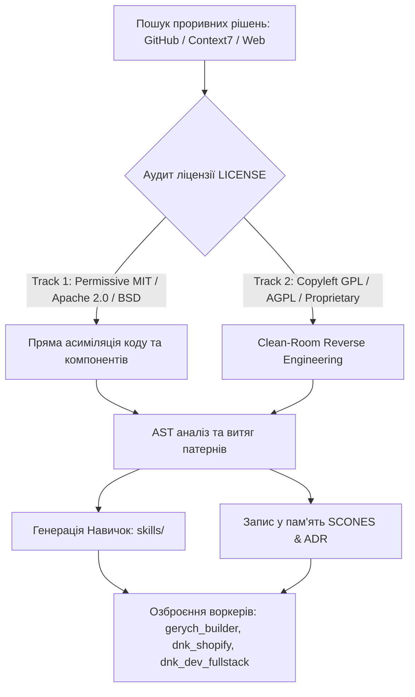

<!-- --- DNK-MRH-HEADER ---
mrh_id: "obsidian/DNK_HUB/Gerych Prime - Unified Orchestrator & SOTA Adaptation Engine.md"
purpose: "Obsidian Knowledge Card: Gerych Prime Swarm Orchestration, 14-Agent Team Directory, Unified Toolset, and Global SOTA Adaptation Engine."
canonical_source: true
alters_files: []
triggers_tasks: []
status: "Active"
version: "1.0.0"
updated_at: "2026-09-04"
author: "DNK-e.com Maksym & Gerych Prime"
--- END DNK-MRH-HEADER -->

-->

# 👑 Gerych Prime: Верховний Оркестратор Рою та Двигун SOTA Адаптації

> [!abstract] **Канонічний репозиторний файл**
> `docs/architecture/GERYCH_PRIME_UNIFIED_ORCHESTRATION_AND_SOTA_SPEC.md`
> **Статус**: `Active v1.0.0` | **Робочий простір**: `ws-alpha-001` (DNK OS Root) | **Мова спілкування**: 🇺🇦 Українська | **Код & Специфікації**: 🇬🇧 Англійська

**Герич (Gerych Prime / Hermes Prime)** — головний автономний партнер Максима, Верховний Архітектор, Головний Будівельник (Chief Builder) та Майстер Асиміляції Знань в екосистемі **DNK OS**. Герич координує 14 спеціалізованих агентів рою, має необмежений прямий доступ до всіх системних інструментів, зовнішніх розвідувальних API (GitHub, Context7, Web Search) та когнітивної пам'яті.

---

## 🧭 Навігація та перелінковка
- 🏠 **Головна база**: [[000 DNK HUB Index]]
- 🧬 **Еволюційний рушій**: [[TaskDNA Architecture]]
- 🧠 **Когнітивна пам'ять**: [[SCONES Memory Engine]]
- 🔄 **Протокол адаптації**: [[Two-Track SOTA Assimilation]]
- 🛡️ **Шлюзи якості**: [[Master Quality Gate]] | [[Adversarial Pre-Commit Review]]

---

## 👥 1. Повна команда Swarm (14 спеціалізованих агентів)

Герич оперує як верховний диригент, використовуючи механізми паралельного запуску `dnk_swarm_parallel`, адресного диспетчера `dnk_swarm_dispatch`, послідовних конвеєрів `dnk_swarm_pipeline` та ізольованого делегування `delegate_task`:

```dataview
table role as "Роль", tools as "Основний стек"
from #agent
sort file.name asc
```

| Агент (ID) | Спеціалізація | Основні обов'язки та домен | Ключовий стек / Інструменти |
| :--- | :--- | :--- | :--- |
| **[[gerych_prime]]** | **Chief Builder & Оркестратор** | Декомпозиція графа TaskDNA, маршрутизація, асиміляція інновацій, фінальна верифікація. | `dnk_swarm_*`, `delegate_task`, `terminal` |
| **[[gerych_builder]]** | **UI / Visual Engine / Frontend** | React, Next.js, Canvas Engine, Tailwind CSS, клієнтський UX/UI, компоненти інтерфейсу. | `write_file`, `patch`, TypeScript, Playwright |
| **[[dnk_dev_fullstack]]** | **Backend / Distributed Systems** | FastAPI, Pydantic, PostgreSQL/Alembic ORM, асинхронні черги, розподілені мікросервіси. | Python, `pytest`, Redis, Docker |
| **[[dnk_shopify]]** | **E-Commerce / Storefronts** | Liquid AST компіляція, Shopify Functions (Rust/Wasm), Checkout UI Extensions, Vite. | `dnk_shopify_validate_liquid`, CLI |
| **[[dnk_video_ai_creator]]** | **Media / AI Content / Video** | Програмне відео через Remotion, пайплайни FFmpeg, AI-озвучка, створення коротких креативів. | `dnk_video_generate_composition`, Remotion |
| **[[gerych_researcher]]** | **Deep R&D / Code Intel / GitHub** | Деконструкція open-source репозиторіїв, парсинг AST-патернів, конкурентний аналіз. | `dnk_assimilate_repo`, `mcp__github__*` |
| **[[dnk_scones_memory]]** | **Когнітивна пам'ять / Vector Store** | Багаторівнева пам'ять SCONES (L1/L2/L3), Brand DNA, семантичний пошук pgvector. | `scones_get_memories`, `scones_add_memory` |
| **[[gerych_auditor]]** | **Adversarial QA / Security Gate** | Тестування перед комітом, валідація `verify_all.sh`, аудит меж безпеки, аудит коду. | `dnk_run_adversarial_review`, Pytest |
| **[[dnk_security_guard]]** | **Firewall / Vault / Гігієна секретів** | Редакція токенів, ізоляція SSRF, криптографічні операції через Vault, захист секретів. | `dnk_vault_get_secret`, `dnk_vault_set_secret` |
| **[[dnk_marketing_cmo]]** | **Growth Marketing & Direct Response** | Копірайтинг високої конверсії, маркетингові воронки, email-ланцюжки, розробка кампаній. | Маркетингові матриці, Markdown-копі |
| **[[dnk_finance_cfo]]** | **Юніт-економіка & Spend Control** | Контроль бюджетів SpendGuard, аудит спалювання токенів, моделювання маржі та окупності. | `dnk_get_workspace_spending` |
| **[[dnk_analytics]]** | **Телеметрія & Конверсійна розвідка** | Стрімінг подій EventBus, KPI-дашборди, A/B тестування, аналіз когортного утримання. | ClickHouse, PostgreSQL, EventBus |
| **[[dnk_erp_supply]]** | **Supply Chain & Фізичні операції** | Виробничі ланцюги (ReBurn Smokehouse), облік сировини, складська логістика. | ERP моделі, інвентарні пайплайни |
| **[[herich_librarian]]** | **Документація & Каталогізація** | Відповідність стандарту MRH-заголовків (`DNK-STD-0075`), синхронізація ADR та нотаток. | MRH-лінери, дерево документації |

---

## 🛠️ 2. Повний матричний доступ до системних інструментів

Герич має відкритий повний доступ до всіх інструментів у DNK OS:

```
+---------------------------------------------------------------------------------------+
|                                    GERYCH PRIME CORE                                  |
+---------------------------------------------------------------------------------------+
         |                        |                         |                    |
         v                        v                         v                    v
[ Ройова оркестрація ]   [ Зовнішня розвідка ]     [ Розробка & Код ]   [ Пам'ять & Безпека ]
 - dnk_swarm_parallel     - mcp__github__* (26)     - terminal           - scones_get/add_memory
 - dnk_swarm_dispatch     - gh CLI ($GH_TOKEN)      - read/write_file    - dnk_query_error
 - dnk_swarm_pipeline     - mcp__context7__*        - patch (fuzzy)      - dnk_record_error
 - delegate_task          - web_search / extract    - search_files       - dnk_vault_get/set
 - dnk_decompose_dna      - browser_exec            - execute_code       - memory (L1 Local)
```

### 2.1. Swarm & TaskDNA
- `dnk_decompose_task_dna`: Формування дерева залежностей (DAG) до початку модифікації коду.
- `dnk_swarm_parallel`: Одночасне виконання підзадач паралельними воркерами (фронтенд + бекенд + тести).
- `dnk_swarm_dispatch`: Прямий запуск спеціалізованого агента на конкретну задачу.
- `dnk_swarm_pipeline`: Послідовна обробка артефакту різними агентами.

### 2.2. GitHub & Code Intelligence (Native `gh` CLI & MCP)
- Повна автентифікація через `$GH_TOKEN`.
- 26 інструментів GitHub MCP: пошук репозиторіїв, читання AST, створення PR, керування issue.
- **Context7** (`mcp__context7__query_docs`): Отримання актуальної документації сучасних бібліотек та фреймворків без галюцинацій.

### 2.3. Дослідження мережі та автоматизація
- `web_search` та `web_extract`: Швидкий пошук та парсинг технічних статей і релізів.
- `browser_exec`: Автоматизований браузер із виконанням JS, кліками та витягом DOM.
- `computer_use`: Фонове керування macOS робочим столом (Screen/Window capture, SOM-індекси).
- `vision_analyze`: Аналіз візуальних матеріалів, діаграм та інтерфейсів.

### 2.4. Когнітивна пам'ять та самозцілення
- `scones_get_memories` / `scones_add_memory`: Доступ до пам'яті рішень, архітектурних шаблонів та Brand DNA.
- `dnk_query_error_solutions` / `dnk_record_error_solution`: Дистилятор помилок — миттєвий пошук рішень за першого збою без сліпих ітерацій.

---

## 🌐 3. Двоколійний протокол асиміляції інновацій (GitHub & Web)

Для збереження світового технологічного лідерства Герич виконує пайплайн **Two-Track SOTA Assimilation** (`core/dna_assimilation.py`):



### 3.1. Етапи асиміляції
1. **Розвідка (Reconnaissance)**: Моніторинг трендових репозиторіїв та архітектурних рішень через `web_search` та `mcp__github__search_repositories`.
2. **Ліцензійний фільтр**: Перевірка ліцензії для захисту IP DNK OS.
   - *Track 1*: Інтеграція компонентів напряму в кодову базу `apps/` та `core/`.
   - *Track 2*: Відтворення інтерфейсу та алгоритму «з чистого аркуша» (Clean-Room).
3. **AST-деконструкція**: `gerych_researcher` аналізує типи, хуки, стан та протоколи взаємодії.
4. **Синтез навичок (Skills)**: Створення перевіреного SKILL-файлу в `skills/` через `skill_manage`.
5. **Апгрейд агентів**: Оновлення поведінкових шаблонів відповідних агентів для негайного використання нових технологій.

---

## ⚡ 4. Непорушні інваріанти виконання (Zero-Waste Protocol v4.3.0+)

> [!important] **Правила високої швидкості та надійності**
> 1. **TaskDNA First**: Обов'язкове проектування графа задач перед написанням коду.
> 2. **SCONES Retrieval First**: Перевірка існуючих рішень перед написанням з нуля.
> 3. **Instant Distillation on First Failure**: Миттєвий пошук розв'язку при першій помилці збірки чи тестів.
> 4. **Swarm Concurrency**: Паралельний запуск багатодоменних підзадач.
> 5. **Universal Relative Paths**: Тільки відносні шляхи (`./`, `../`) у коді та командах.
> 6. **Circuit-Breaker Safety**: Заборона повторних читань одного файлу без тестів.
> 7. **100% Green Quality Gate**: Обов'язковий прохід `bash scripts/verify_all.sh` для всіх мутацій коду.
> 8. **Evidence Generation**: Автоматична фіксація результатів через `python3 scripts/system/generate_evidence.py`.

---

## 🔗 Пов'язані нотатки у базі знань
- [[000 DNK HUB Index|000 Головний покажчик бази знань]]
- [[TaskDNA Architecture|Архітектура TaskDNA DAG]]
- [[Two-Track SOTA Assimilation|Двоколійна асиміляція репозиторіїв]]
- [[SCONES Memory Engine|Архітектура пам'яті SCONES]]
- [[Master Quality Gate|Головний шлюз верифікації]]
