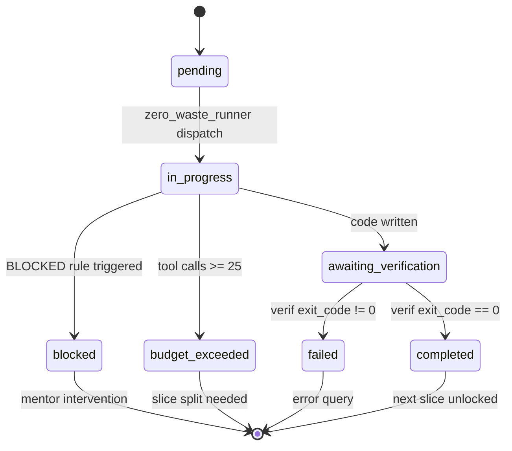

<!-- --- DNK-MRH-HEADER ---
mrh_id: "docs/standards/GERYCH_TASK_TEMPLATE.md"
purpose: "Canonical Standard & Execution Governance for Generating High-Velocity Zero-Waste Tasks for Gerych Prime"
canonical_source: true
alters_files: []
triggers_tasks: []
status: "Active"
version: "1.1.0"
updated_at: "2026-09-04"
author: "DNK-e.com Maksym, Antigravity Mentor & Perplexity Mentor"
--- END DNK-MRH-HEADER --- -->

# 🛡️ DNK-STD-0080: Канонічний Шаблон Завдань для Герича (Zero-Waste Protocol v1.1)

Цей стандарт є обов'язковим інженерним керівництвом для постановки завдань агенту-будівельнику **Hermes Gerych Prime**. Він гарантує надійне виконання, запобігає вичерпанню бюджету ітерацій, усуває параліч планування (Planning Paralysis) та забезпечує повний Execution Governance (контроль бюджету, скоупу, diff, блокувань та верифікації).

---

## 1. Фундаментальні Принципи (Анатомія Zero-Waste Завдання)

| № | Принцип | ❌ Помилковий патерн | ✅ Канонічний патерн Zero-Waste v1.1 |
|---|---|---|---|
| **1** | **Імперативна директива** | *"Герич, ти готовий? Чекаю підтвердження"* | `СЛАЙС 1.1: Створити BaseMindMapNode та 5 нод. ВИКОНУЙ НЕГАЙНО.` |
| **2** | **Бюджет `tool_calls_budget`** | Завдання на 2–3 дні без лімітів | **≤ 25 викликів інструментів на слайс** (Read: 8, Write: 8, Verif: 4). |
| **3** | **Таргетовані шляхи** | *"Зроби компоненти десь у canvas"* | Точний список відносних шляхів (`apps/web/...`). Тільки дозволений скоуп. |
| **4** | **Правило блокування (BLOCKED)** | Бездумне модифікування сусідніх файлів | При конфлікті API або невідповідності ТЗ: **повернути `BLOCKED` з доказом**. |
| **5** | **Авто-верифікація та YAML-звіт** | Декларативне «все зроблено» | `tsc` / `pytest` + структурований звіт із `exit_code: 0`. |

---

## 2. Модель Бюджету Виконання (Execution Budget)

Кожен слайс обмежується об'єктом бюджету:

```python
@dataclass
class ExecutionBudget:
    max_tool_calls: int = 25       # Абсолютний максимум викликів на один слайс
    max_read_calls: int = 8        # Ліміт читань файлів (перешкоджає search-петлям)
    max_write_calls: int = 8       # Ліміт створення/модифікації файлів
    max_verification_calls: int = 4 # Ліміт запусків тестових команд
```

---

## 3. Канонічний Шаблон для Слайсу (Single Slice v1.1)

```markdown
# 🎯 ZERO-WASTE SLICE [N.M]: [Назва завдання]

## 📌 DIRECTIVE
Виконай цей слайс негайно. Не створюй окремий план і не запитуй підтвердження. Працюй суворо в межах цільових файлів.

## 🔒 PRECONDITIONS
- Repository root: `./`
- Branch: `[feature/branch-name]`
- Allowed scope: тільки перелічені цільові файли
- Forbidden: git commit, push, merge, зміни файлів поза scope
- Execution Budget: максимум 25 tool calls (read: 8, write: 8, verif: 4)

## 📁 TARGET FILES
- [NEW] `шлях/до/файлу_1.tsx`
- [MODIFY] `шлях/до/файлу_2.ts`

## 📋 REQUIREMENTS
- `[Конкретна технічна вимога 1: типи, пропси, handles]`
- `[Конкретна технічна вимога 2: стилізація, клас nodrag, inline-edit]`
- `[Конкретна технічна вимога 3: використання публічного API useCanvasStore.getState().updateNodeData()]`

## 🧪 VERIFICATION
```bash
[Команда: наприклад, npx --prefix apps/web tsc --project apps/web/tsconfig.json --noEmit]
```

## ✅ DoD (Критерії успіху)
- ✅ Файли створено або змінено тільки в межах дозволеного scope
- ✅ Команда верифікації повертає exit code 0
- ✅ Фактичний diff перевірено
- ✅ Відсутні невиконані TODO або mock-заглушки у scope

## 🛑 BLOCKED RULE
Якщо вимога суперечить реальному коду репозиторію, існуючий API не відповідає ТЗ або потрібна зміна файлу поза scope:
НЕ вигадуй API і не змінюй додаткові файли.
Зупинись та поверни статус `BLOCKED` із зазначенням точної причини та доказу:
- `status: BLOCKED`
- `blocked_reason: "..."`
- `evidence: "..."`
- `recommended_next_slice: "..."`

## 📤 REQUIRED REPORT
Поверни строго структурований YAML-звіт:
```yaml
status: COMPLETED # або BLOCKED, FAILED, BUDGET_EXCEEDED
files_changed: []
verification:
  command: "[команда]"
  exit_code: 0
tests: []
assumptions: []
remaining_risks: []
```

## 🚀 EXECUTION MODE
Одразу редагуй target files через `write_to_file` або `patch`.
Після першої успішної верифікації заверши слайс і надай фінальний звіт.
```

---

## 4. Життєвий Цикл Статусів Слайсу (Orchestrator Lifecycle)



---

## 5. Робота з Невідомими Файлами та Запобігання Розходженню API

1. **Якщо цільовий файл існує** — прочитати його цільовий діапазон рядків (`offset`/`limit`).
2. **Якщо не існує** — створити через `write_to_file`.
3. **Публічний API** — використовувати виключно підтверджені методи (наприклад, `updateNodeData(id, patch)` у `canvasStore.ts`). Заборонено створювати ad-hoc аліаси.
4. **Кластеризація (UX Invariant)**:
   - Кластер у React Flow моделюється як **Group/Parent Node** або контейнер, а не як спрямована лінія залежності.
   - Еджі призначені строго для смислових та функціональних зв'язків (`DependencyEdge`, `RelationEdge`, `MilestoneEdge`).

---

## 6. Pre-Flight Guard Чек-лист (Перед запуском слайсу)

- [ ] **1. Імперативність**: директива не містить слів очікування підтвердження.
- [ ] **2. Атомарність**: не більше 2–6 пов'язаних файлів у target files.
- [ ] **3. Ієрархія компонентів**: за наявності групи схожих компонентів обов'язково виділено базовий спільний компонент (`BaseMindMapNode.tsx`).
- [ ] **4. Точний API**: підтверджено наявність викликаних функцій у поточному коді.
- [ ] **5. Валідна команда верифікації**: вказано робочий скрипт без побічних ефектів.
- [ ] **6. Структурований звіт**: вимагається YAML звіт замість вільної прози.
