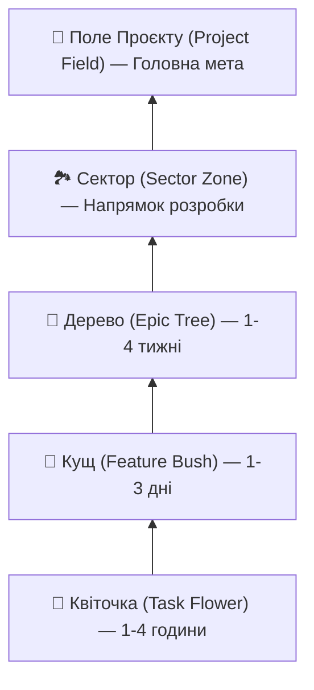

# 🌾 Open-Source Obsidian Task Forest Engine (`dnk_obsidian_task_forest`)

**DNK OS Task Forest Engine** — це відкрита, Local-First утиліта та набір шаблонів для Obsidian, які перетворюють ваші розробницькі нотатки на живий сад/ліс задач із рекурсивним авто-підрахунком прогресу готовності знизу вгору (**Bottom-Up Rollup**).

---

## 🌻 Шкала Метафори Рослин (Plant Hierarchy Scale)



1. **🌾 Поле (Project Field)**: Корінь всього проєкту (наприклад `Shopify Store Launch`).
2. **🏞️ Сектор (Sector Zone)**: Напрямок у проєкті (`Frontend`, `Core Infra`, `Marketing`).
3. **🌳 Дерево (Epic Tree)**: Масштабне епічне завдання.
4. **🌿 Кущ (Feature Bush)**: Фіча або середня задача.
5. **🌱 Квіточка (Task Flower)**: Атомарна мікро-підзадача.

---

## 🚀 Переваги для Користувачів Obsidian

- **100% Local-First & Markdown Native**: Усі дані зберігаються у вигляді звичайних `.md` нотаток із YAML-фронтматером у вашому Obsidian Vault.
- **Ніколи не забувайте підзадачі**: Головна задача не може досягти 100%, доки всі вкладені квіточки та кущі не перейдуть у статус `completed`.
- **Авто-генерація Mermaid `graph BT`**: Генерація діаграм із напрямком росту **знизу вгору** прямо в Obsidian.
- **Повна інтеграція з Dataview**: Підтримка нативних Obsidian Dataview запитів у шаблонах.

---

## 🛠️ Встановлення та Використання

1. **Скопіюйте шаблони** з папки `templates/` у вашу папку шаблонів Obsidian.
2. **Створюйте нотатки задач** за допомогою відповідного шаблону (`Project_Field`, `Sector_Zone`, `Epic_Tree`, `Feature_Bush`, `Task_Flower`).
3. **Запустіть сканування Vault**:
   ```bash
   PYTHONPATH=. uv run pytest services/dnk_obsidian_task_forest/tests/ -v
   ```

---

## 🛡️ Ліцензія

Apache-2.0 License. Розроблено для спільноти **DNK OS** & **Obsidian Community**.
