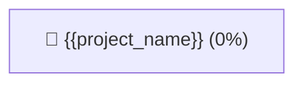

# 🌾 Поле Проєкту: {{project_name}}

**Статус Поля**: `{{status}}` | **Власник**: `{{owner}}`  
**Загальний Прогрес Задач-Рослин**: `0%`

---

## 🏞️ Сектори Та Напрямки (Sector Zones)

```dataview
TABLE status, progress, plant_scale
FROM #dnk-sector-zone
WHERE project_id = "{{project_id}}"
SORT file.name ASC
```

---

## 📊 Візуальний Граф Поля (Mermaid Graph BT — Ріст Знизу Вгору)



---

## 📝 Нотатки Проєкту та Стратегія
- Опишіть головну мету поля та ключові результати.
